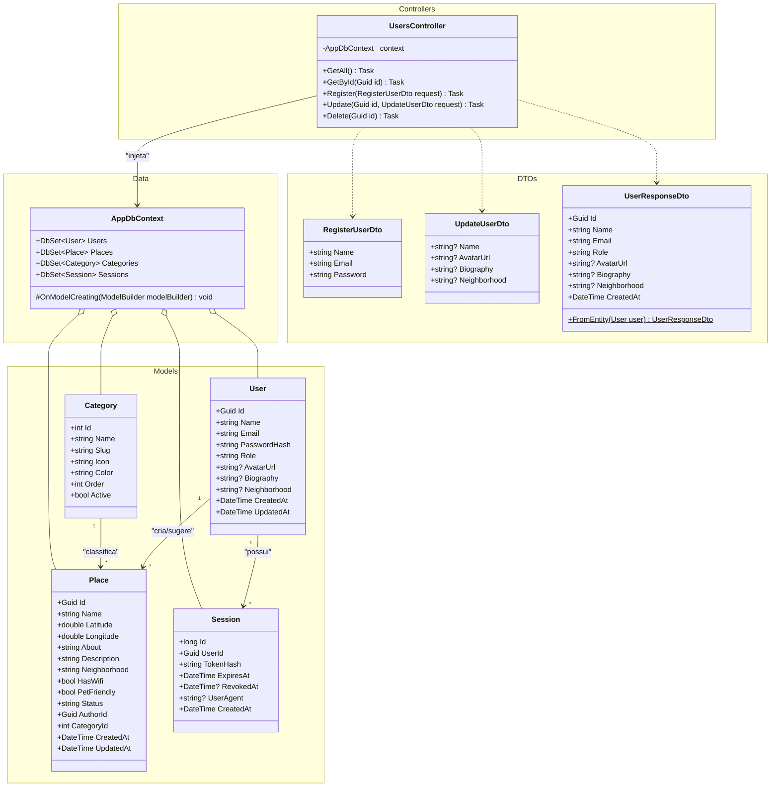

# Diagrama de Classes — Arquitetura Completa

Visão consolidada das classes da API Soromaps, seus contextos e relacionamentos estruturais no backend ASP.NET Core.

```mermaid
classDiagram
    direction TB

    namespace Models {
        class User {
            +Guid Id
            +string Name
            +string Email
            +string PasswordHash
            +string Role
            +string? AvatarUrl
            +string? Biography
            +string? Neighborhood
            +DateTime CreatedAt
            +DateTime UpdatedAt
        }

        class Place {
            +Guid Id
            +string Name
            +double Latitude
            +double Longitude
            +string About
            +string Description
            +string Neighborhood
            +bool HasWifi
            +bool PetFriendly
            +string Status
            +Guid AuthorId
            +int CategoryId
            +DateTime CreatedAt
            +DateTime UpdatedAt
        }

        class Category {
            +int Id
            +string Name
            +string Slug
            +string Icon
            +string Color
            +int Order
            +bool Active
        }

        class Session {
            +long Id
            +Guid UserId
            +string TokenHash
            +DateTime ExpiresAt
            +DateTime? RevokedAt
            +string? UserAgent
            +DateTime CreatedAt
        }
    }

    namespace Data {
        class AppDbContext {
            +DbSet~User~ Users
            +DbSet~Place~ Places
            +DbSet~Category~ Categories
            +DbSet~Session~ Sessions
            #OnModelCreating(ModelBuilder modelBuilder) void
        }
    }

    namespace DTOs {
        class RegisterUserDto {
            +string Name
            +string Email
            +string Password
        }
        class UpdateUserDto {
            +string? Name
            +string? AvatarUrl
            +string? Biography
            +string? Neighborhood
        }
        class UserResponseDto {
            +Guid Id
            +string Name
            +string Email
            +string Role
            +string? AvatarUrl
            +string? Biography
            +string? Neighborhood
            +DateTime CreatedAt
            +FromEntity(User user)$ UserResponseDto
        }
    }

    namespace Controllers {
        class UsersController {
            -AppDbContext _context
            +GetAll() Task
            +GetById(Guid id) Task
            +Register(RegisterUserDto request) Task
            +Update(Guid id, UpdateUserDto request) Task
            +Delete(Guid id) Task
        }
    }

    User "1" --> "*" Place : "cria/sugere"
    User "1" --> "*" Session : "possui"
    Category "1" --> "*" Place : "classifica"
    AppDbContext o-- User
    AppDbContext o-- Place
    AppDbContext o-- Category
    AppDbContext o-- Session
    UsersController --> AppDbContext : "injeta"
    UsersController ..> UserResponseDto
    UsersController ..> RegisterUserDto
    UsersController ..> UpdateUserDto
```
