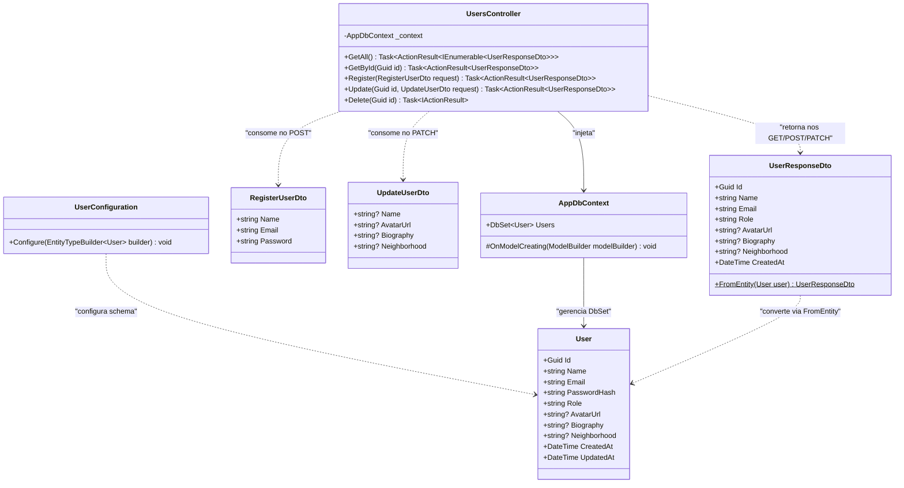

# Diagrama de Classes — Módulo de Usuários

Este diagrama representa a estrutura de classes C# do módulo de usuários, abrangendo Entidades de Domínio, Configurações de Mapeamento (Fluent API), Data Transfer Objects (DTOs) e a camada de Controladores.

