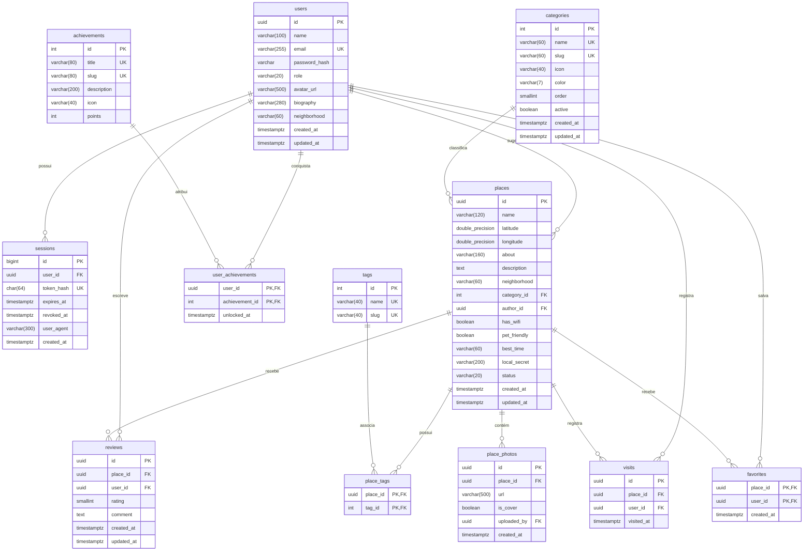

# Diagrama Entidade-Relacionamento (DER) — Modelo Completo

Modelo lógico e relacional do banco de dados PostgreSQL (`public`) do Soromaps, desenhado com nomenclatura `snake_case` e integridade referencial.

