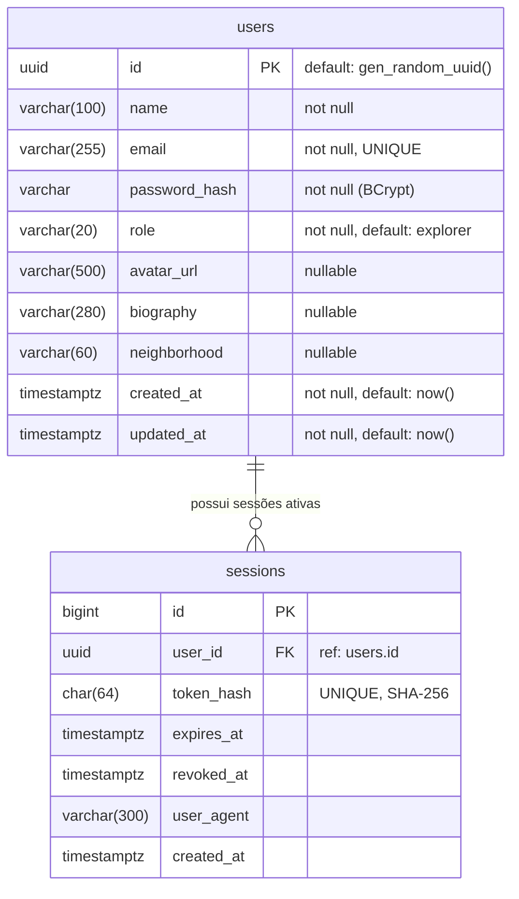

# Diagrama Entidade-Relacionamento (DER) — Módulo de Usuários

Este diagrama descreve a tabela `users` no PostgreSQL do Supabase, incluindo tipos de dados nativos, constraints e índices criados via Fluent API no EF Core.

