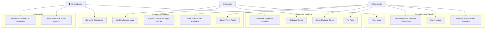

# Diagrama de Casos de Uso — Sistema Completo

Visão holística de todos os casos de uso da API do Soromaps agrupados por módulos de negócio.

```mermaid
flowchart TD
    Visitante["👤 Visitante"]
    Explorador["🧭 Explorador"]
    Admin["🛡️ Administrador"]

    subgraph Auth ["Autenticação & Sessão"]
        A1["Fazer Login"]
        A2["Renovar Access Token (Refresh)"]
        A3["Fazer Logout"]
        A4["Desconectar de Todos os Dispositivos"]
    end

    subgraph Users ["Gestão de Usuários"]
        U1["Cadastrar Conta"]
        U2["Ver Perfil"]
        U3["Editar Dados e Bairro"]
        U4["Gerenciar Papéis de Usuários"]
    end

    subgraph Places ["Lugares e Catálogo"]
        P1["Explorar Pontos no Mapa (bbox)"]
        P2["Ver Detalhes do Lugar"]
        P3["Sugerir Novo Ponto"]
        P4["Subir Foto via URL Assinada"]
        P5["Gerenciar Categorias"]
    end

    subgraph Moderation ["Moderação"]
        M1["Aprovar/Rejeitar Ponto Sugerido"]
        M2["Moderar Avaliações e Denúncias"]
    end

    Visitante --> A1
    Visitante --> U1
    Visitante --> P1
    Visitante --> P2

    Explorador --> A2
    Explorador --> A3
    Explorador --> A4
    Explorador --> U2
    Explorador --> U3
    Explorador --> P3
    Explorador --> P4

    Admin --> U4
    Admin --> P5
    Admin --> M1
    Admin --> M2
```
