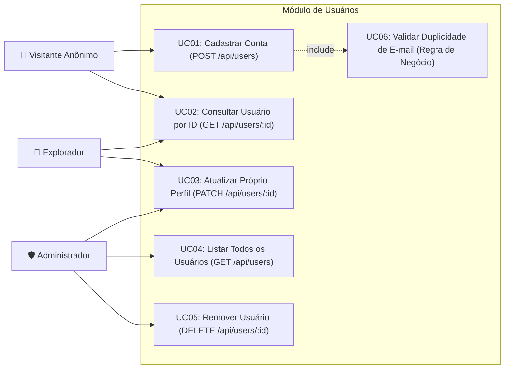

# Diagrama de Casos de Uso — Módulo de Usuários

Este diagrama descreve as interações funcionais dos atores (**Visitante Anônimo**, **Explorador Autenticado** e **Administrador**) com o módulo de usuários da API.

