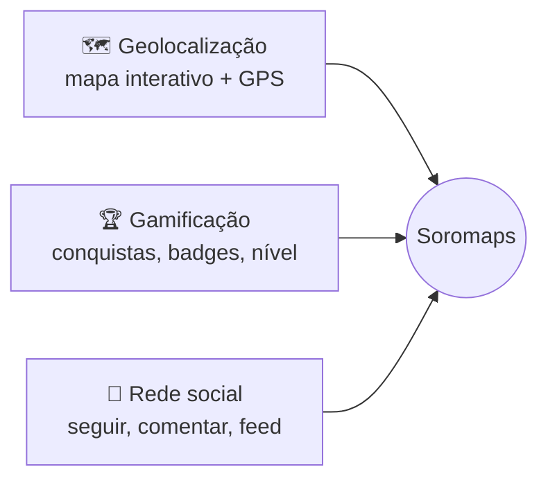

> 📐 **Trilha: projetado (TCC).** Descreve a intenção de produto. Para o que existe rodando, ver [07 — Arquitetura atual](../../wiki/02-arquitetura.md).

# 🌆 01. Visão geral

O Soromaps é uma plataforma digital interativa para **descobrir, avaliar e compartilhar experiências em estabelecimentos locais de Sorocaba**. A proposta combina três pilares para transformar exploração urbana em atividade colaborativa e divertida:

A aposta central: avaliação feita por quem mora na cidade vale mais que avaliação genérica de plataforma global.

---

## 🚩 Dores atacadas

| # | Dor | Pilar que responde |
|---|---|---|
| 1 | Dificuldade em descobrir lugares novos e autênticos | Geolocalização |
| 2 | Falta de confiança em avaliações impessoais ou não locais | Rede social |
| 3 | Falta de engajamento social em torno da cultura local | Rede social |
| 4 | Baixa visibilidade de estabelecimentos menores | Geolocalização |
| 5 | Experiência turística pouco imersiva e personalizada | Gamificação |
| 6 | Falta de reconhecimento para quem contribui com indicações | Gamificação |

---

## 💰 Modelo de negócio

Plataforma de dois lados:

| Lado | Como participa | Monetização |
|---|---|---|
| **Usuários finais** | Uso gratuito. Produzem o conteúdo (avaliações, fotos, pontos) e o engajamento | Nenhuma — são o ativo |
| **Estabelecimentos** | Perfil verificado por CNPJ, com estatísticas e resposta direta a clientes | Principal fonte futura (perfil/plano pago) |

O Canvas completo está no material de apresentação do TCC, não versionado neste repositório.

---

## 👤 Personas

### 🍔 Augusto Silva — o dono de estabelecimento

| Atributo | Valor |
|---|---|
| Idade | 32 |
| Profissão | Dono de lanchonete (ArtBurguer) |
| Cidade | Sorocaba |

Empreendedor formado em Administração, hands-on, apaixonado por gastronomia. Valoriza feedback genuíno, mas não tem onde centralizar essa conversa com o cliente.

**Objetivo:** expandir o negócio (segunda unidade em 2 anos) com base no que os clientes apontam.

**Como o Soromaps atende:** perfil de estabelecimento com estatísticas de avaliação (RF-10), resposta a comentários (RF-09) e visibilidade no mapa (RF-05).

### 📱 Sara Almeida — a exploradora local

| Atributo | Valor |
|---|---|
| Idade | 25 |
| Profissão | Auxiliar de RH / estudante de Marketing Digital |
| Cidade | Sorocaba |

Muito ativa em redes sociais, escreve resenhas no Letterboxd, sai nos fins de semana atrás de cafeterias, restaurantes e bares. Quer avaliação com substância — atendimento, ambiente, cardápio, diferencial — não só uma média de estrelas.

**Objetivo:** um lugar confiável para descobrir e para as próprias resenhas dela terem utilidade.

**Como o Soromaps atende:** análise com conteúdo + estrelas (RF-07), comentários com resposta (RF-09), gamificação reconhecendo quem contribui e busca com filtros (RF-11/RF-12).

> 📄 Fichas completas (`Persona_1.pdf`, `Persona_2.pdf`) estão no material do TCC.

---

## 🧭 Decisões deste domínio

### Foco geográfico em Sorocaba
**Decisão:** lançar restrito a Sorocaba em vez de plataforma genérica de qualquer cidade.
**Motivo:** a dor central é confiança em avaliação *local*; escopo restrito viabiliza densidade de conteúdo mesmo com base pequena de usuários. Alternativa descartada: multi-cidade desde o início, com custo de aquisição inviável para um TCC.

O código carrega essa decisão de forma literal: o viewport inicial do mapa é fixo em Sorocaba (`-23.472, -47.446`) em [`src/app/(app)/(explorer)/home/page.tsx`](../../../src/app/(app)/(explorer)/home/page.tsx).

---

## ➡️ Próxima página

[02 — Requisitos](./02-requisitos.md)
