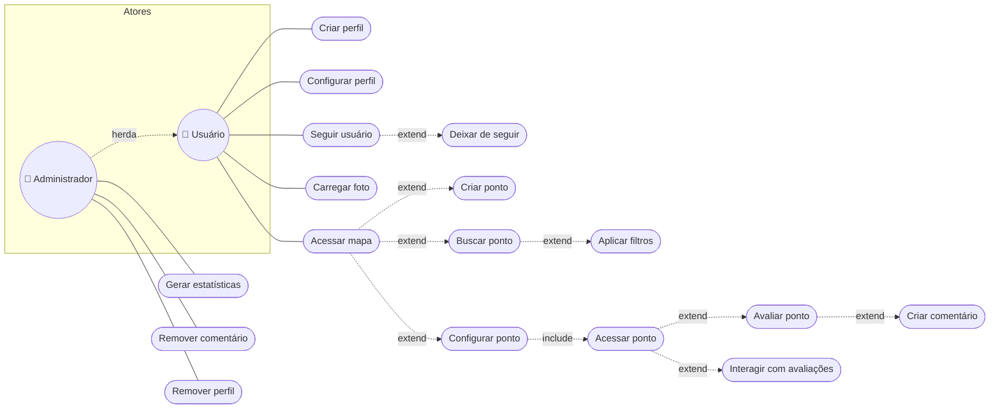

> 📐 **Trilha: projetado (TCC).** Conversão em Mermaid do diagrama de casos de uso de alto nível.

# 🎭 03. Casos de uso

Dois atores: **Usuário** (que pode ser pessoa física ou estabelecimento) e **Administrador**, que herda tudo do Usuário e ganha moderação e estatísticas globais.

> 🖼️ Original: `Diagrama_de_Casos_de_Uso_-_Alto_Nível.pdf`, no material do TCC.

---

## 📇 Catálogo de casos

| Caso de uso | Ator | Relação | Requisito |
|---|---|---|---|
| Criar perfil | Usuário | — | RF-01 |
| Configurar perfil | Usuário | — | RF-02 |
| Acessar mapa | Usuário | — | RF-03, RF-04 |
| Criar ponto | Usuário | `extend` de Acessar mapa | RF-05 |
| Configurar ponto | Usuário | `extend` de Acessar mapa | RF-06 |
| Acessar ponto | Usuário | `include` de Configurar ponto | RF-06 |
| Avaliar ponto | Usuário | `extend` de Acessar ponto | RF-07 |
| Criar comentário | Usuário | `extend` de Avaliar ponto | RF-09 |
| Interagir com avaliações | Usuário | `extend` de Acessar ponto | RF-09, RF-13 |
| Buscar ponto | Usuário | `extend` de Acessar mapa | RF-11 |
| Aplicar filtros | Usuário | `extend` de Buscar ponto | RF-12 |
| Seguir usuário | Usuário | — | RF-13 |
| Deixar de seguir | Usuário | `extend` de Seguir usuário | RF-13 |
| Carregar foto | Usuário | — | RF-08 |
| Gerar estatísticas | Administrador | — | RF-10 |
| Remover comentário | Administrador | — | moderação |
| Remover perfil | Administrador | — | moderação |

---

## 🧭 Decisões deste domínio

### Administrador como ator especializado
**Decisão:** Administrador herda todos os casos do Usuário e acrescenta só moderação e estatísticas globais.
**Motivo:** evita duplicar caso de uso no diagrama — a diferença real entre os papéis é conjunto de permissões, não fluxo distinto.

**Estado no código:** existe uma área `/admin` no front (listagem de usuários com criar/editar/excluir, mais telas de negócios e avaliações), mas **não há papel/role em lugar nenhum** — nem coluna no banco, nem checagem no `middleware.ts`, nem autorização na API. Na prática, qualquer sessão válida acessa `/admin`. Ver [10 — Autenticação e sessão](../../wiki/05-autenticacao-e-sessao.md).

---

## ➡️ Próxima página

[04 — Arquitetura projetada](./04-arquitetura-projetada.md)
