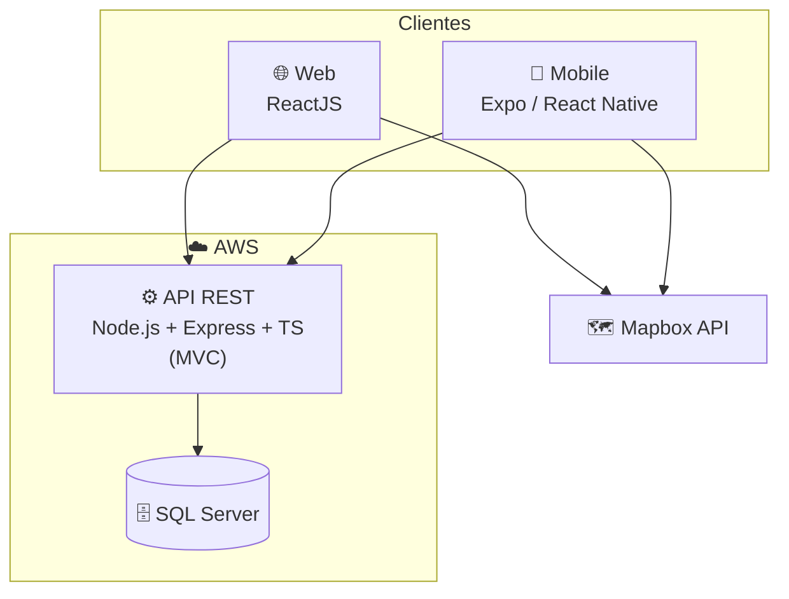
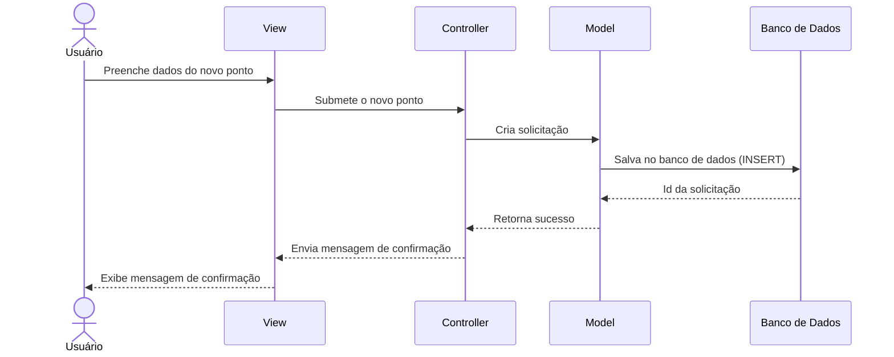

> 📐 **Trilha: projetado (TCC).** Esta é a arquitetura do papel. A implementação divergiu — ver [07 — Arquitetura atual](../../wiki/02-arquitetura.md) e [12 — Gap](../../wiki/09-backlog.md).

# 🏛️ 04. Arquitetura projetada

Arquitetura cliente-servidor clássica: dois clientes (web e mobile) consumindo uma API REST única em Node.js, com SQL Server hospedado na AWS e Mapbox como provedor de mapas.

---

## 🧱 Stack e divisão de responsabilidades

| Camada | Tecnologia projetada | Responsável no TCC |
|---|---|---|
| Frontend | ReactJS | Gabriel Acciari |
| Backend | Node.js + Express + TypeScript | Nicolas |
| Banco de Dados | SQL Server | Otávio |
| Mobile | Expo (React Native) | Arthur |
| Nuvem | AWS | Gabriel Nunes |

Tabela mantida como registro da divisão acordada no TCC.

---

## 🔄 Fluxo de sequência — criação de ponto (RF-05)

Fluxo MVC pensado para o caso de uso "Criar ponto":

> 🖼️ Export original: [`Diagrama-de-Sequencia.png`](../diagramas-originais/Diagrama-de-Sequencia.png)

---

## 🧭 Decisões do desenho original

### MVC no backend Express
**Decisão:** organizar a API em View → Controller → Model.
**Motivo:** padrão consolidado na disciplina, mapeamento direto com o diagrama de sequência e separação de responsabilidades sem overhead de framework opinativo. NestJS foi considerado e descartado pelo escopo do TCC.

### API única para web e mobile
**Decisão:** frontend web e app Expo consomem a mesma API REST.
**Motivo:** evita duplicar regra de negócio; a diferença entre plataformas fica só na apresentação. **Essa decisão sobreviveu** — a API .NET atual atende o mesmo papel.

### Mapbox em vez de Google Maps
**Decisão:** Mapbox como provedor de mapas.
**Motivo:** free tier mais generoso para escopo acadêmico e SDK maduro para React e React Native. **Substituída** por MapLibre + basemaps CARTO, que dispensa conta e token.

---

## 📊 O que sobreviveu

| Decisão original | Situação hoje |
|---|---|
| API REST única para web e mobile | ✅ Mantida (agora em .NET) |
| Separação apresentação × regra de negócio | ✅ Mantida |
| MVC no backend | 🟡 Parcial — `Controller` e `Model` existem; a "View" virou o Next.js |
| Node.js + Express + TypeScript | ❌ Substituído por ASP.NET Core 10 |
| SQL Server | ❌ Substituído por PostgreSQL |
| Mapbox | ❌ Substituído por MapLibre + CARTO |
| Hospedagem AWS | ⏳ Não provisionada |
| App mobile Expo | ⏳ Não iniciado |

---

## ➡️ Próxima página

[05 — Modelagem projetada](./05-modelagem-projetada.md)
