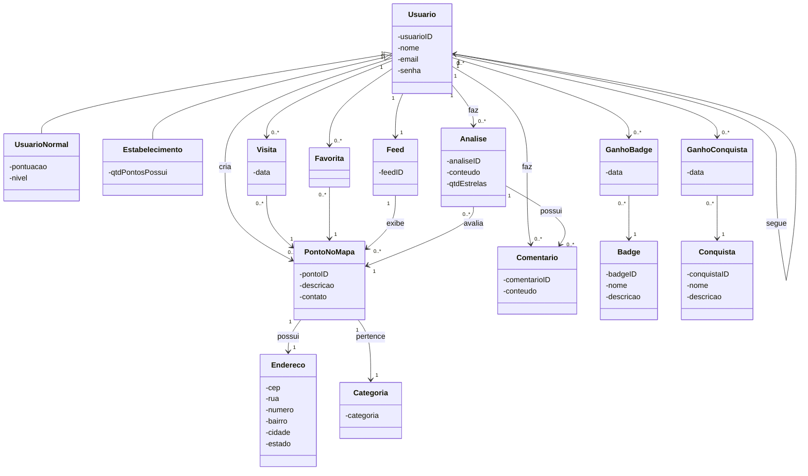
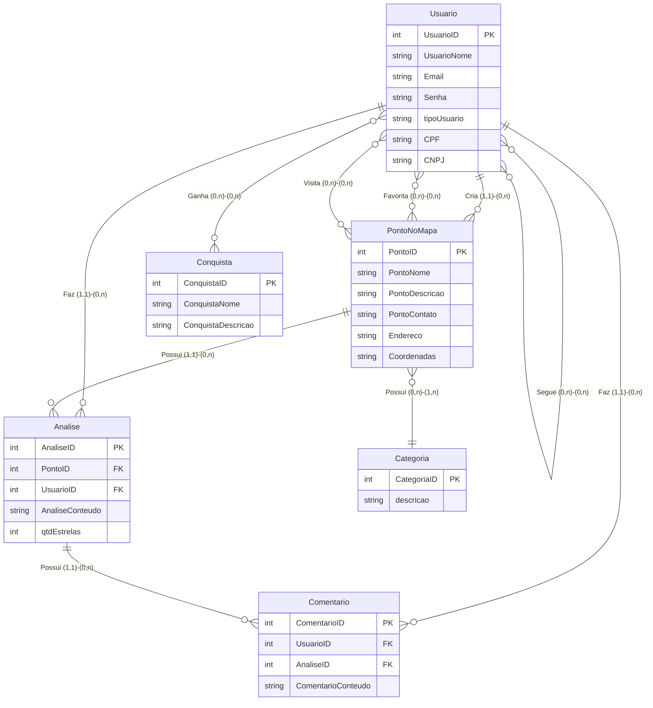
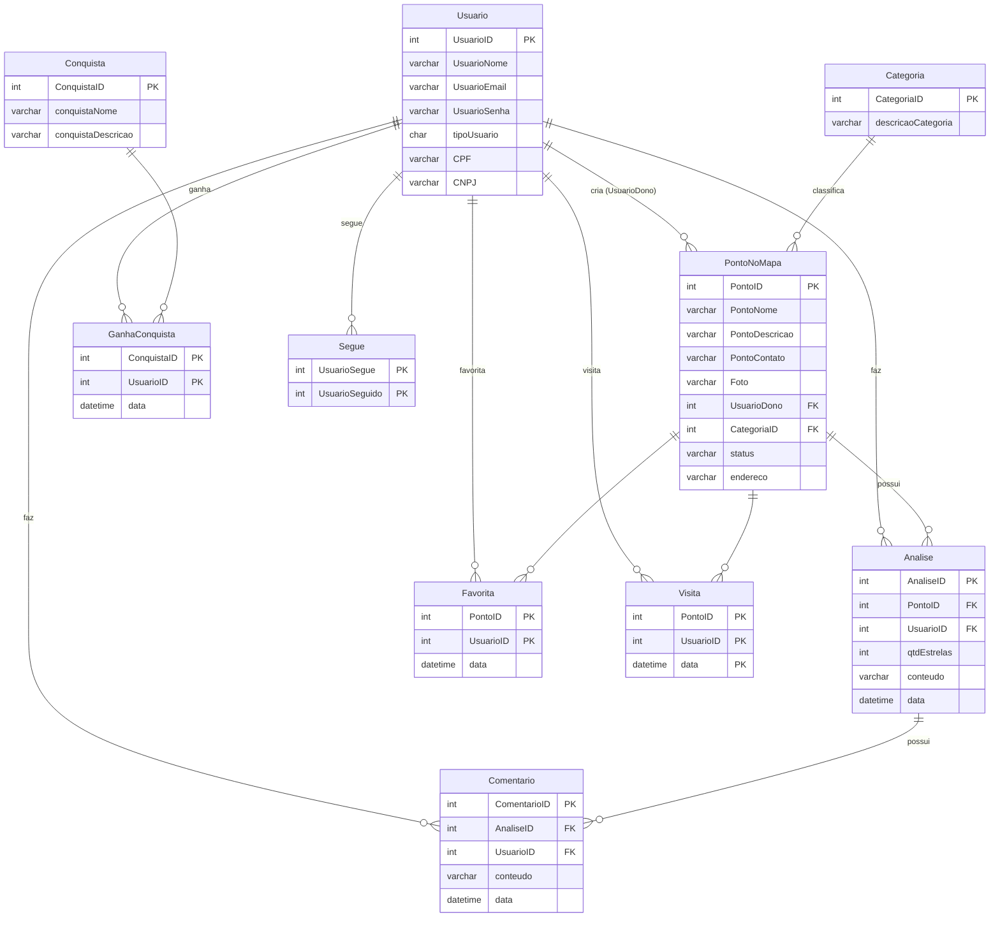

> 📐 **Trilha: projetado (TCC).** Os três diagramas de modelagem, convertidos dos exports originais para Mermaid. O banco real hoje tem duas tabelas — ver [08 — Banco atual](../../wiki/03-banco.md).

# 🗄️ 05. Modelagem projetada

A modelagem foi feita em três níveis, do mais abstrato ao mais concreto:

| Nível | Artefato | O que acrescenta | Export original |
|---|---|---|---|
| Conceitual OO | Diagrama de classes | Herança, agregação, visão de produto | [`diagrama-conceitual.png`](../diagramas-originais/diagrama-conceitual.png) |
| Conceitual ER | DER | Atributos e cardinalidades `(min, max)` | [`Diagrama_Entidade-Relacionamento.png`](../diagramas-originais/Diagrama_Entidade-Relacionamento.png) |
| Lógico | Tabelas | Tipos, PK, FK, tabelas associativas | [`Modelo-Logico.png`](../diagramas-originais/Modelo-Logico.png) |

---

## 🧩 Nível 1 — Conceitual (classes)

Visão orientada a objetos. É o único nível onde aparecem `Feed`, `Badge` e a herança de `Usuario`.

---

## 🔗 Nível 2 — DER

Mesmo domínio em notação entidade-relacionamento. Duas diferenças que importam em relação ao conceitual: some a herança (o tipo vira atributo `tipoUsuario`, com `CPF` e `CNPJ`) e aparece **`Coordenadas`** em `Ponto no mapa`.

Relacionamentos N:N do DER carregam atributos próprios, que no lógico viram tabelas:

| Relacionamento | Atributos | Vira a tabela |
|---|---|---|
| Visita | `UsuárioID`, `PontoID`, `Data` | `Visita` |
| Favorita | `UsuárioID`, `PontoID` | `Favorita` |
| Ganha | `ConquistaID`, `UsuárioID`, `Data` | `GanhaConquista` |
| Segue | auto-relacionamento de `Usuário` | `Segue` |

---

## 📐 Nível 3 — Modelo lógico

Dez tabelas com tipo, PK e FK — o nível que uma migration implementaria diretamente.

> As colunas marcadas `PK` em `Favorita`, `Visita`, `Segue` e `GanhaConquista` são **também FK** — Mermaid não representa chave dupla numa linha só.

---

## 🔀 Do conceitual ao lógico — o que mudou

| Mudança | Detalhe |
|---|---|
| **Herança → single table** | `UsuarioNormal` (pontuação, nível) e `Estabelecimento` (qtdPontosPossui) viraram uma tabela só com `tipoUsuario` + `CPF`/`CNPJ` nullable |
| **`Endereco` → coluna** | A classe com cep/rua/número/bairro/cidade/estado foi achatada em `PontoNoMapa.endereco` |
| **`Feed` e `Badge` fora** | Continuam no conceitual como visão de produto; fora do MVP do banco (conquistas já cobrem a gamificação inicial) |
| **`Coordenadas` sumiu** | Presente no DER, ausente no lógico. Lacuna, não simplificação — sem coordenada não se plota ponto no mapa |
| **`status` e `Foto` apareceram** | Colunas novas no lógico, sem contraparte no DER: moderação de ponto e RF-08 (upload de foto) |

---

## 🧭 Decisões deste domínio

### Single table para tipos de usuário
**Decisão:** `tipoUsuario` (CHAR) discriminando normal/estabelecimento na mesma tabela, `CPF` e `CNPJ` nullable.
**Motivo:** os dois tipos compartilham quase todos os relacionamentos (avaliar, comentar, seguir, criar ponto); tabelas separadas exigiriam FK polimórfica ou duplicação em toda tabela associativa.

### `data` na PK de `Visita`
**Decisão:** PK composta `(data, PontoID, UsuarioID)` em vez de só `(PontoID, UsuarioID)`.
**Motivo:** o mesmo usuário visita o mesmo ponto várias vezes, e o histórico alimenta as estatísticas (RF-10). `Favorita` não leva `data` na PK porque favoritar é estado, não evento.

### Comentário pendurado na Análise, não no Ponto
**Decisão:** `Comentario.AnaliseID` como FK, não `PontoID`.
**Motivo:** atende o RF-09 (comentário *com resposta*) — comentário é conversa em torno de uma avaliação específica, como resposta a uma resenha, não mural solto do estabelecimento.

---

## 📚 Glossário

| Termo | Significado |
|---|---|
| DER | Diagrama Entidade-Relacionamento — entidades, atributos e cardinalidades |
| Single Table Inheritance | Hierarquia de classes representada em uma tabela só, com coluna discriminadora |
| Tabela associativa | Materializa um N:N e pode carregar atributos próprios (ex.: `data`) |
| Cardinalidade `(min, max)` | Quantas ocorrências de uma entidade participam do relacionamento — `(0,n)` = opcional e múltiplo |

---

## ➡️ Próxima página

[06 — Protótipo](./06-prototipo.md)
