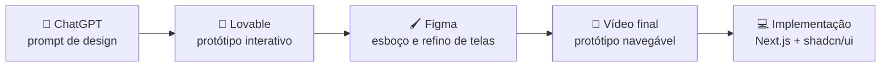

> 📐 **Trilha: projetado (TCC).** Protótipos e apresentações que precederam o código.

# 🎨 06. Protótipo e apresentações

A prototipação teve duas etapas: um esboço gerado com IA (prompt no ChatGPT → protótipo visual no Lovable) e a versão final navegável, com as telas refinadas no Figma.

---

## 🖼️ Artefatos

| Artefato | Link |
|---|---|
| Protótipo interativo (Lovable) | [Abrir no Lovable](https://lovable.dev/projects/34adcffe-6501-4183-aec1-ae3e1c7b06c8?magic_link=mc_ddf65ff8-f77e-4929-84ea-cbf5d6afa24c) |
| Esboço de telas (Figma) | [Abrir no Figma](https://www.figma.com/make/QeH6cpMMMLzWpcahXSmB4E/Plataforma-Interativa-Sorocaba?node-id=0-1&p=f&t=4B6XvFunslTZ5fr7-0) |

---

## 🎥 Vídeos

### Vídeo do protótipo (primeira versão)

👉 [Assistir no YouTube](https://www.youtube.com/watch?v=m91OOovIXdA)

- Contextualização com Canvas, personas e modelo de negócio
- Tela inicial e navegação principal
- Simulação do mapa e explicação da integração com a API de mapas
- Tela de perfil do usuário

*Edição e narração automatizadas com IA via Canva.*

### Vídeo da apresentação final

👉 [Assistir no YouTube](https://youtu.be/ikABfE7xs0U?si=GWaXctGDIQR5dzzm)

- Resumo do projeto
- Jornada do usuário
- Protótipo final navegável
- Diagramas
- Template documentado

---

## 🔄 O que sobreviveu no código

| Elemento do protótipo | No app hoje |
|---|---|
| Mapa em tela cheia como tela principal | ✅ [`/home`](../../../src/app/(app)/(explorer)/home/page.tsx) |
| Painel deslizante sobre o mapa | ✅ Drawer com snap points (`vaul`) |
| Feed de tendências e novidades | 🟡 Componentes existem, dados ainda mockados |
| Perfil do usuário | 🟡 Rota existe, conteúdo mínimo |
| Avaliação com estrelas | ❌ Não implementado |

O vídeo mostra o mapa com a API do Mapbox; a implementação trocou por MapLibre + basemaps CARTO — motivo em [07 — Arquitetura atual](../../wiki/02-arquitetura.md).

---

## 🧭 Decisões deste domínio

### Prototipar com IA antes de codar
**Decisão:** validar o fluxo visual com protótipo gerado por IA em vez de partir direto para o código.
**Motivo:** iteração de UI em horas em vez de dias, liberando o tempo do time para a modelagem (requisitos, DER, casos de uso) — que é o que a banca avalia primeiro.

---

## ➡️ Próxima página

[07 — Arquitetura atual](../../wiki/02-arquitetura.md) — início da trilha do que existe implementado.
