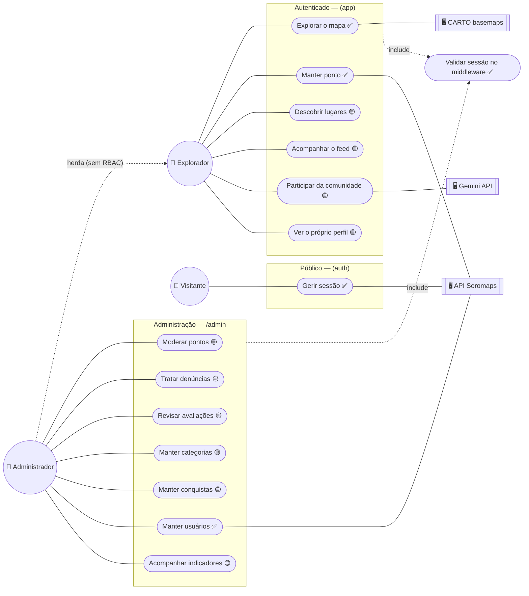

# 01. Visão geral — atores e pacotes

Três atores primários e três atores de sistema. Os pacotes são as fronteiras
que o código já tem: route group `(auth)`, `(explorer)` e a pasta `admin/`.

## Atores

| Ator | Quem é | Onde o código o reconhece |
|---|---|---|
| **Visitante** | Sem cookie `session`. Só alcança `/login` e `/register` | `middleware.ts` redireciona qualquer rota protegida para `/login` |
| **Explorador** | Sessão válida. É todo usuário autenticado do produto | JWT HS256 em cookie `httpOnly`, assinado pelo Next (`src/lib/session.ts`) |
| **Administrador** | **Não existe como papel.** Hoje é o mesmo Explorador com a sidebar de admin visível | `NAV_GROUP_ADMIN` aparece para toda sessão em `src/constants/navigation.ts` |

## Atores de sistema

| Sistema | Papel | Realidade |
|---|---|---|
| **API Soromaps** (ASP.NET Core, repo `soromaps_api`) | Credenciais, CRUD de usuários e de marcadores | Real, mas **sem autenticação** — todo endpoint é público |
| **CARTO basemaps** | Estilo `positron` / `dark-matter` do MapLibre | Real, sem token |
| **Gemini API** (`gemini-2.5-flash`) | Redige o rascunho de pauta | Real e **server-only**; sem `GEMINI_API_KEY` devolve o estado `sem-chave` e a tela avisa que está desligada |

> `Segue` **não aparece** em nenhum diagrama daqui: o grafo social saiu do
> produto em 2026-08-17. E o ator "dono de estabelecimento" saiu em
> 2026-08-19 — ver `docs/archive/gerenciamento-por-dono/`.

---

➡️ [02 — Explorador](./02-explorador.md)
