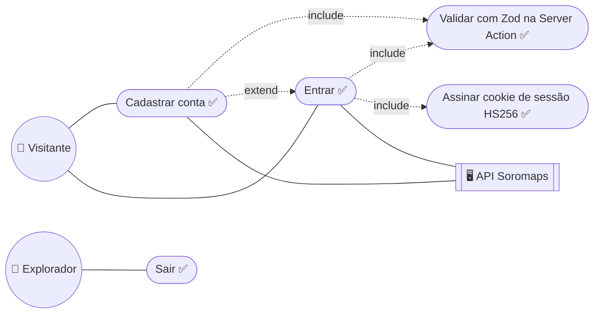
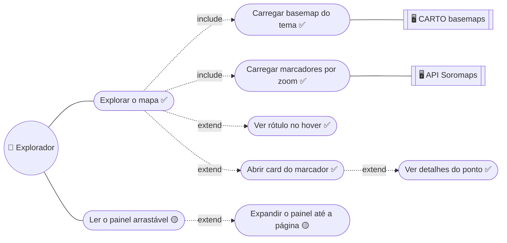
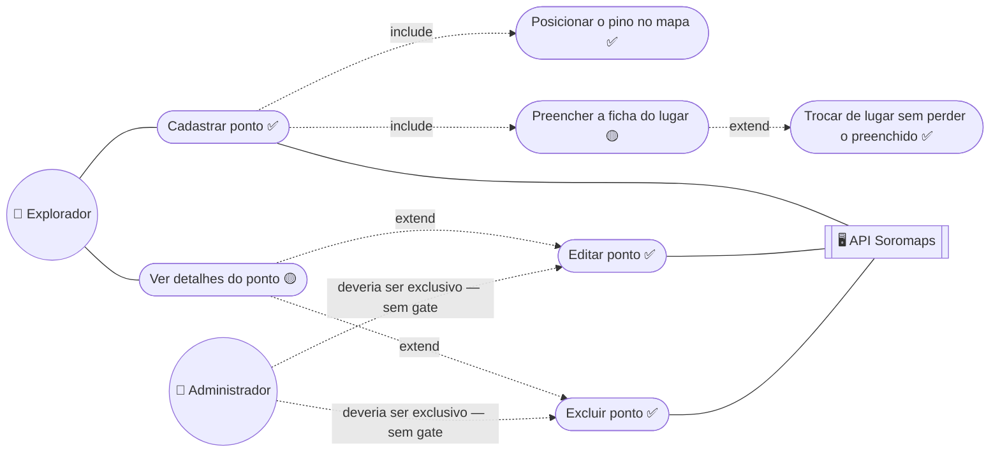
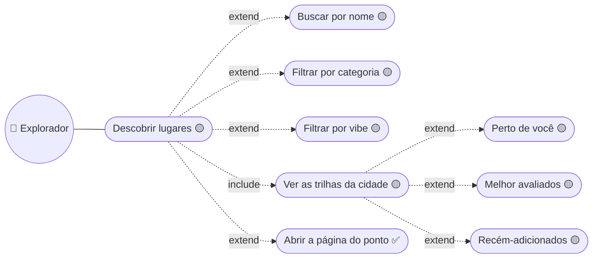

# 02. Explorador — sessão, mapa, ponto e descoberta

## Sessão

Quem confere a senha é a API (BCrypt); quem assina o JWT e grava o cookie
`httpOnly` é o Next — decisão de 2026-07-28. Por isso `Sair` não toca a API:
é só apagar o cookie (`logoutAction`).

> **Buraco conhecido:** o login diferencia "usuário não encontrado" de "senha
> incorreta", o que é enumeração de usuário. Está no backlog de segurança.

---

## Mapa interativo · `/home`

`Carregar marcadores por zoom` é `include` e não `extend` porque não é opção do
usuário: `use-markers.ts` assina `moveend` e busca sozinho ao cruzar o zoom
mínimo. **Este é o caso quebrado em produção** — sem `NEXT_PUBLIC_API_URL` o
`fetch` vira caminho relativo e dá 404 na Vercel. Ver
[`wiki/08-deploy.md`](../../wiki/08-deploy.md).

O card do marcador é só display desde 2026-08-03: editar e excluir moram na
página cheia.

---

## Ponto · `/places/new` e `/places/[id]`

Dois avisos que o diagrama carrega de propósito:

- **`Preencher a ficha do lugar` é 🟡 dentro de um caso ✅.** O formulário
  coleta 8 campos e a API recebe 3 — foto, sobre, categoria, wifi, petfriendly,
  melhor horário e segredo local são validados no navegador e descartados. É
  deliberado; o spec está em
  [`propostas/2026-08-03-expansao-modelo-ponto.md`](../../propostas/2026-08-03-expansao-modelo-ponto.md).
- **Editar e excluir não têm gate.** Qualquer sessão válida faz os dois. A
  seta pontilhada registra a intenção, não uma barreira implementada.

---

## Descobrir · `/discover`

`/places` deixou de ser tela em 2026-08-17 — a rota-índice é um
`redirect("/discover")`. A trilha personalizada ("você esteve aqui") espera a
tabela `Visita`.

---

➡️ [03 — Explorador social](./03-explorador-social.md)
