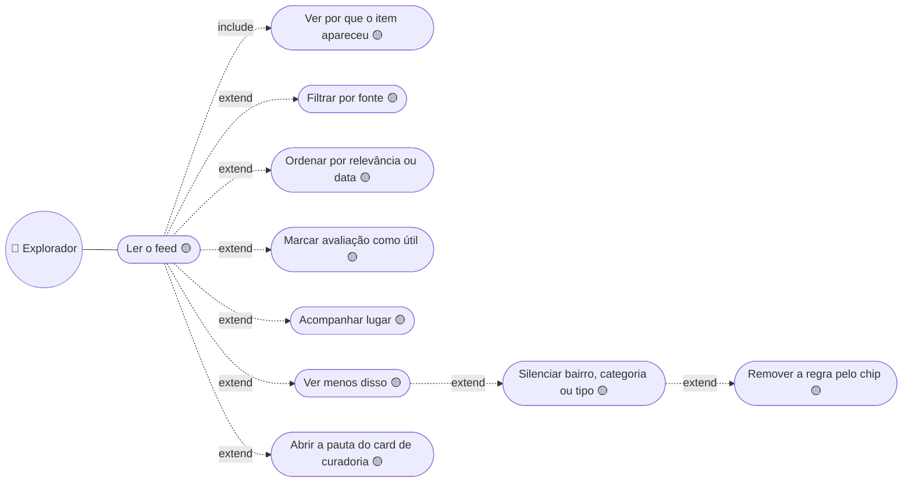
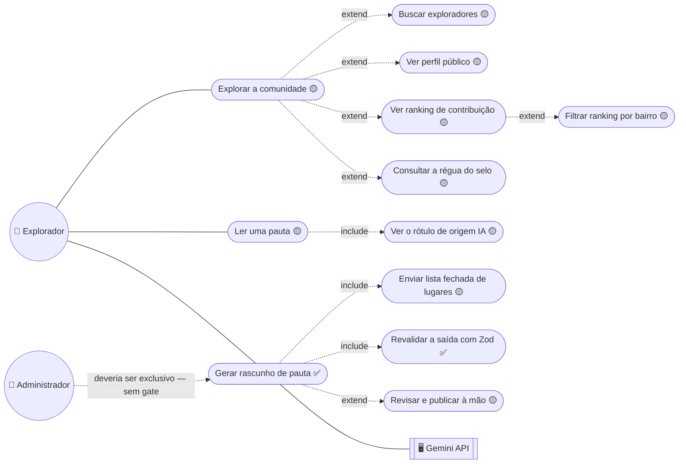
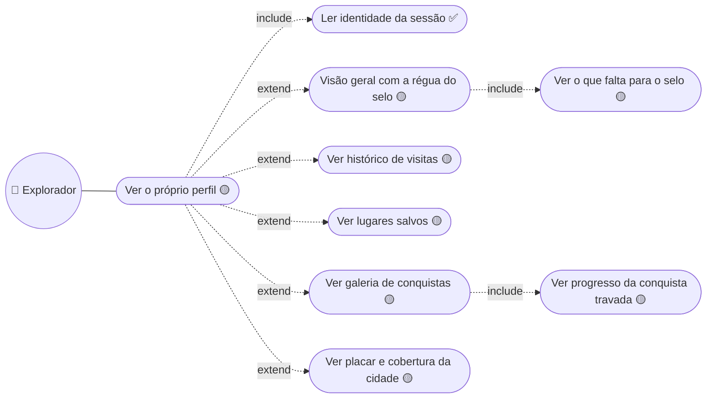

# 03. Explorador — feed, comunidade, pauta e perfil

## Feed · `/feed`

`Ver por que o item apareceu` é `include`, não `extend`: `FeedCardFrame` exige
`reason`, então card sem motivo não compila. Os cinco motivos são `perto`,
`salvo`, `categoria`, `cidade` e `curadoria`.

Não há `Seguir usuário` — decisão de 2026-08-17, detalhada em
[`adr/user/0002-feed-sem-grafo-social.md`](../../adr/user/0002-feed-sem-grafo-social.md).
"Útil" mede se a dica ajudou a decidir; "curtir" mediria simpatia pelo autor,
que é o eixo que este feed não tem.

---

## Comunidade e pauta · `/community`, `/pautas/[slug]`

O gerador fica no cabeçalho da vitrine de pautas, aberto a **qualquer
sessão** — o mesmo buraco de `/places/[id]`, e ele queima cota de um modelo
pago. Entra no gate junto com o papel de administrador.

A chamada ao Gemini é **o único caminho de verdade** desta área — o resto vem
de `src/mocks/{community,stories}.ts`. Três regras que o diagrama carrega:

- **Geração é etapa de autoria, não de render.** Nada roda durante a navegação
  do leitor: alguém pede o rascunho, o modelo escreve, um humano publica.
- **`Revalidar a saída com Zod` é `include`.** `responseSchema` garante forma,
  não conteúdo — saída de LLM é entrada não confiável.
- **Rascunho responde 404** na rota pública, e pauta de origem `ia` aparece
  rotulada ao leitor.

O selo de verificado é régua pública, não chancela: ≥5 visitas, ≥3 avaliações
publicadas, nenhuma removida e ≥1 mês de conta
(`src/constants/verification.ts`).

---

## Perfil · `/profile`

As cinco abas são **segmento de rota**, não `useState` — decisão de
2026-08-19: conteúdo que se lê, se compartilha e ao qual se volta precisa de
URL. `/visits`, `/favorites`, `/stats` e `/achievements` viraram `redirect()`.

`Ler identidade da sessão` é o único ✅ da tela; o resto deriva de
`src/mocks/profile.ts` sobre as mesmas 24 visitas de `currentExplorerMock`.

**Fora do diagrama porque não existe:** editar dados do perfil (é `/settings`,
travado pelo `PUT` que re-hasheia a senha) e remover favorito (nasce com a
tabela `Favorita`).

---

➡️ [04 — Administrador](./04-administrador.md)
