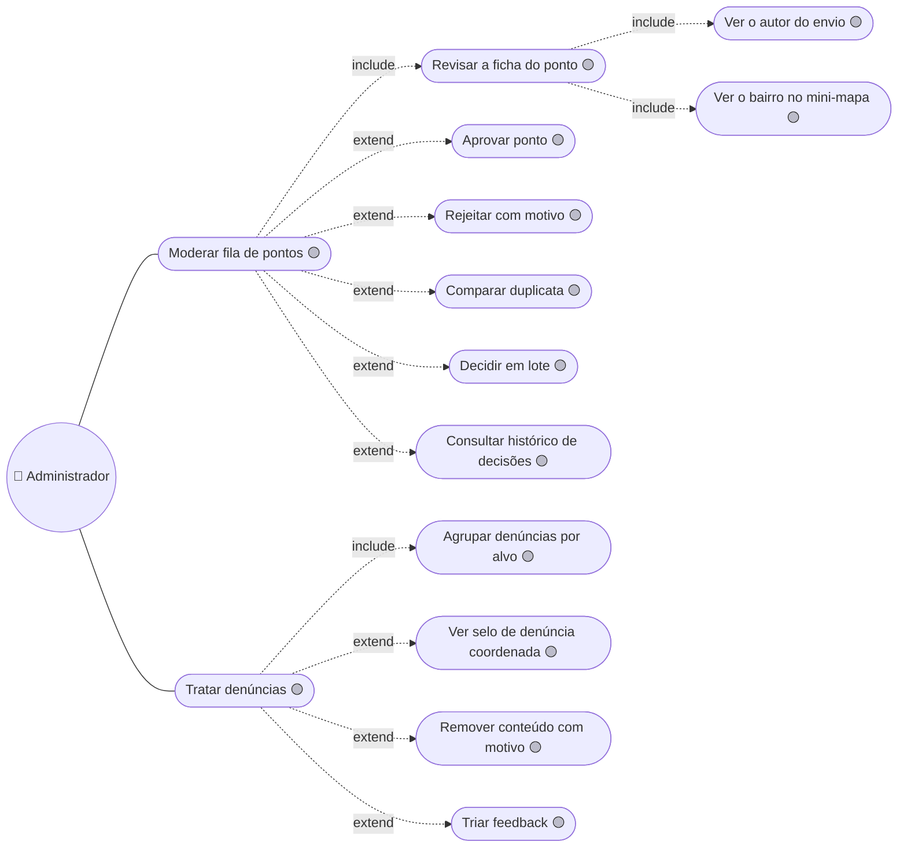
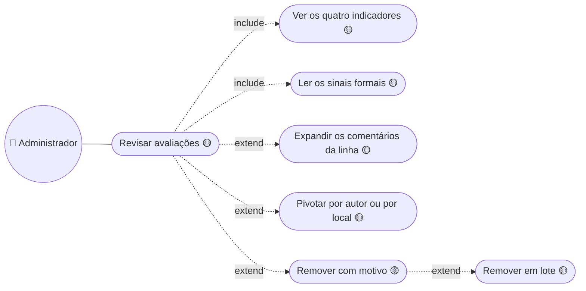
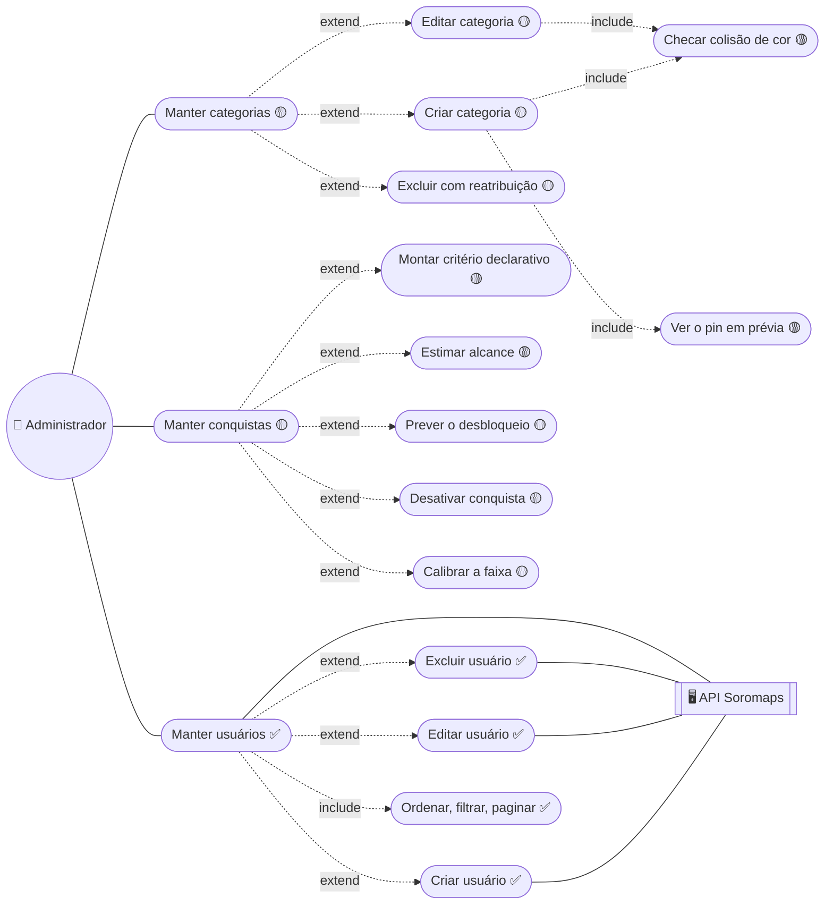
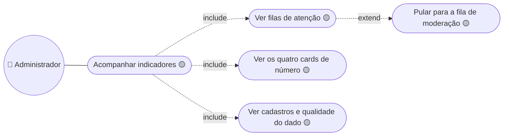

# 04. Administrador — as sete telas de `/admin`

> ⚠️ Nenhum caso desta página tem checagem de papel. Toda sessão válida abre
> `/admin`. O ator existe no desenho, não no `middleware.ts` nem na API.

## Moderação e denúncias

A moderação é mestre-detalhe, não tabela + modal: a decisão **é** a tela. O
mini-mapa é SVG, não MapLibre. Detalhe em
[`adr/admin/0003-moderacao-mestre-detalhe.md`](../../adr/admin/0003-moderacao-mestre-detalhe.md).

Falta a coluna `status` em `markers` e a tabela de decisão — daí o 🟡 em tudo.

## Avaliações

`Remover com motivo` é **o mesmo caso** de `/admin/reports`: `RemovalDialog` e
`REMOVAL_REASONS` já são compartilhados (`src/components/blocks/`,
`src/constants/content-removal.ts`), então quando a Server Action nascer as
duas telas falam igual. Sinais implementados: spam, duplicada, discrepante.

## Catálogos

`/admin/users` é a **única** tela de admin sobre dado real, e a única ✅ do
`todo/README.md`. Os três casos de escrita abrem em rota interceptada no slot
`(app)/@modals` — modal é rota, com URL compartilhável e botão voltar.

`Editar usuário` exige a senha porque o `PUT` da API re-hasheia sempre; a
atualização parcial é item do backlog.

## Dashboard

Espera `GET /api/admin/stats` — um agregado, para o dashboard não fazer N
chamadas de lista só para contar. A série temporal do gráfico é ruído
determinístico sobre data-âncora fixa: `Math.random()` ou `Date.now()` em mock
renderiza diferente no servidor e no cliente e quebra a hidratação.

---

➡️ [05 — Catálogo](./05-catalogo.md)
