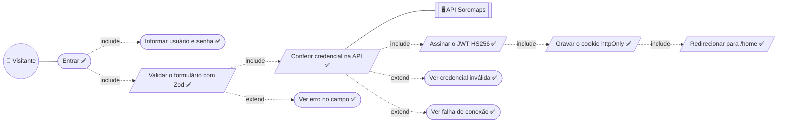
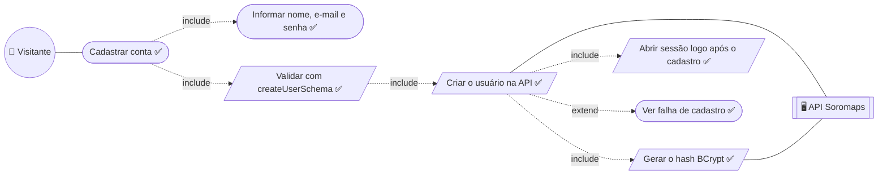
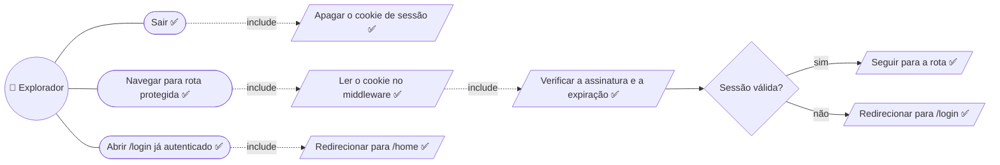

# 01. Sessão e acesso — baixo nível

Detalha a seção Sessão de [02 — Explorador](../02-explorador.md).
Único fluxo do produto inteiramente sobre dado real, junto com `/admin/users`.

## Entrar

`Validar o formulário`, `Conferir credencial`, `Assinar` e `Gravar` são passos
do sistema: acontecem dentro de `loginAction`, sem nova interação.

**Quem confere a senha e quem assina a sessão são sistemas diferentes.** A API
valida com BCrypt e devolve o usuário; o Next assina o JWT e grava o cookie. É
o que deixa o `middleware.ts` decidir acesso no runtime Edge sem ida à API a
cada navegação.

## Cadastrar conta

**O cadastro já entra logado** — `registerAction` cria o usuário e emite o
cookie na mesma chamada, sem passar pela tela de login.

**`Ver falha de cadastro` é genérico por omissão, não por escolha:** sem
`UNIQUE` em `user_name`/`user_email` (`RNF-SEG-13`), cadastrar um nome que já
existe **não falha** — cria a segunda conta e torna o login ambíguo.

## Sair e guarda de rota

`Sair` não toca a API: sessão é do Next, então encerrar é apagar o cookie.

---

## Descrições dos casos

As descrições em template expandido — ator, pré e pós-condição, ações do
ator × ações do sistema numeradas e restrições — vivem em
[`descricoes/01-sessao-e-acesso.md`](../descricoes/01-sessao-e-acesso.md): Cadastrar conta, Entrar, Sair e Acessar rota protegida.

---

➡️ [02 — Mapa e ponto](./02-mapa-e-ponto.md)
