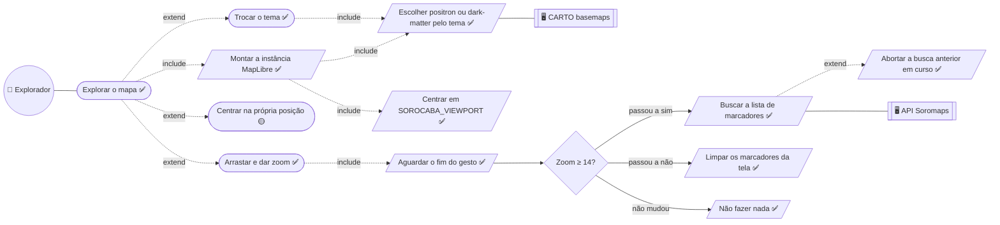
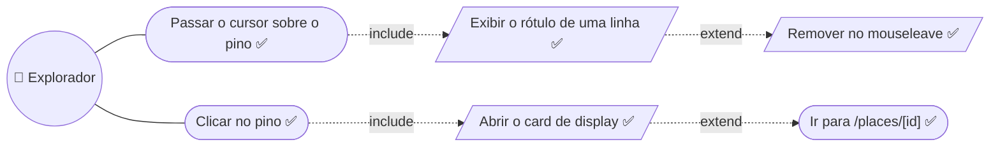
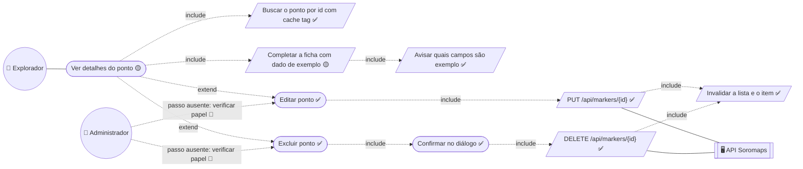

# 02. Mapa e ponto — baixo nível

Detalha as seções Mapa e Ponto de [02 — Explorador](../02-explorador.md).

## Explorar o mapa

**O ramo `não mudou` é o requisito, não um detalhe.** O efeito depende do
booleano `zoom >= minZoom`, não do float do zoom: arrastar e dar zoom dentro da
mesma faixa não dispara requisição nenhuma. A versão anterior dependia de
`viewport.zoom` no `useEffect` e do evento `move`, que dispara a cada quadro —
dezenas de `GET /api/markers` por gesto (`RNF-DES-01`).

**`Centrar na própria posição` é 🟡** porque a coordenada é usada para mover a
câmera e descartada: nada é persistido nem ordenado por proximidade real.

## Ver e abrir um marcador

**O rótulo de hover é `pointer-events-none` e não existe no toque.** Nada dentro
dele é clicável, nunca — por isso ele carrega uma linha, e toda ação mora no
card ou na página cheia.

## Cadastrar ponto

```mermaid
flowchart LR
    EXP(("👤 Explorador"))
    API[["🖥️ API Soromaps"]]

    EXP --- CRIAR(["Cadastrar ponto 🟡"])

    CRIAR -.->|include| ABRE[/"Abrir /places/new no estágio picking ✅"/]
    ABRE -.->|include| ARRASTA(["Arrastar o pino até o lugar ✅"])
    ARRASTA -.->|include| COORD[/"Ler lat e lng da posição do pino ✅"/]
    COORD -.->|include| FORM[/"Passar ao estágio form, mantendo o mapa visível ✅"/]

    FORM -.->|include| CAMPOS(["Preencher os 8 campos 🟡"])
    CAMPOS -.->|extend| VOLTA(["Trocar de lugar sem perder o preenchido ✅"])
    VOLTA -.->|include| ARRASTA

    CAMPOS -.->|include| ZODCLI[/"Validar no navegador com zodResolver 🟡"/]
    ZODCLI -.->|include| ENVIA[/"Enviar o FormData à Server Action ✅"/]
    ENVIA -.->|include| CONVERTE[/"Converter lat e lng para número ✅"/]
    CONVERTE -.->|include| ZODSRV[/"Revalidar com createMarkerSchema ✅"/]
    ZODSRV -.->|include| DESCARTA[/"Descartar os 5 campos sem coluna 🔴"/]
    DESCARTA -.->|include| POST[/"POST /api/markers com nome, lat e lng ✅"/]
    POST -.->|include| TAG[/"Invalidar MARKERS_LIST_TAG ✅"/]
    TAG -.->|include| TOAST[/"Avisar em toast e sair da tela ✅"/]

    ZODSRV -.->|extend| ERRO_CAMPO(["Ver erro por campo ✅"])
    POST -.->|extend| ERRO_REQ(["Ver falha de requisição ✅"])

    POST --- API
```

**`Descartar os 5 campos sem coluna` está desenhado de propósito.** É o passo
que o fluxo executa e que nenhum documento de alto nível mostra: foto, sobre,
categoria, wifi, petfriendly, melhor horário e segredo local são validados no
navegador e param em `toMarkerInput`. Ver `RNF-DAD-16`.

**A conversão para número mora na action, não no schema.** `z.coerce.number()`
deixa o tipo de entrada `unknown` e quebra o `zodResolver` do formulário.

## Editar e excluir ponto

`Buscar o ponto por id` usa `markerShowTag(id)`, e a escrita invalida **as
duas** tags — a do item e a da lista —, para o mapa e a página não discordarem.

---

## Descrições dos casos

As descrições em template expandido — ator, pré e pós-condição, ações do
ator × ações do sistema numeradas e restrições — vivem em
[`descricoes/02-mapa-e-ponto.md`](../descricoes/02-mapa-e-ponto.md): Explorar o mapa, Cadastrar ponto, Editar ponto e Excluir ponto.

---

➡️ [03 — Descoberta e feed](./03-descoberta-e-feed.md)
