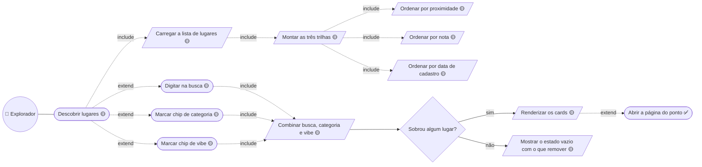
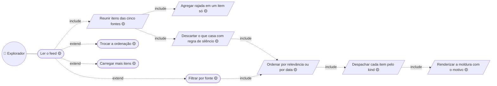
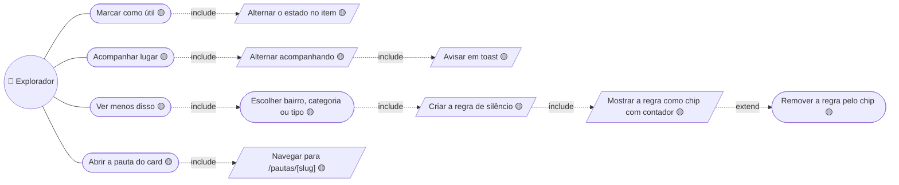

# 03. Descoberta e feed — baixo nível

Detalha a seção Descobrir de [02 — Explorador](../02-explorador.md) e a seção
Feed de [03 — Explorador social](../03-explorador-social.md).

Todo caso desta página roda sobre `src/mocks/markers.ts` e `src/mocks/feed.ts`.

## Descobrir lugares

**Os três critérios combinam, não se substituem** — é a razão de as trilhas
serem seção da mesma tela e não rotas diferentes: critério é seção, não rota.

**`Ordenar por proximidade` é 🟡 duas vezes:** a nota vem do mock *e* a
proximidade também, porque a posição real do explorador não é persistida
(`RF-MAP-04`).

## Ler o feed

**`Agregar rajada` acontece antes de ordenar, não depois.** Sem grafo social, o
lugar movimentado do dia soterraria o feed inteiro: cinco avaliações do mesmo
ponto viram uma linha com o número.

**`Renderizar a moldura com o motivo` é `include` e não `extend`** porque
`FeedCardFrame` exige `reason` no tipo — card sem motivo não compila
(`RF-FED-02`).

## Agir sobre um card

**Nenhum destes escreve em lugar nenhum.** `use-feed.ts` mexe só no array em
memória: recarregar a página desfaz tudo. É o que muda quando `Favorita` e a
tabela de reação nascerem.

**A regra de silêncio vira chip visível de propósito** — filtro que o usuário
esqueceu de ter criado é pior que filtro nenhum (`RNF-USA-07`).

---

## Descrições dos casos

As descrições em template expandido — ator, pré e pós-condição, ações do
ator × ações do sistema numeradas e restrições — vivem em
[`descricoes/03-descoberta-e-feed.md`](../descricoes/03-descoberta-e-feed.md): Descobrir lugares, Ler o feed, Ver menos disso e Acompanhar lugar.

---

➡️ [04 — Comunidade e perfil](./04-comunidade-e-perfil.md)
