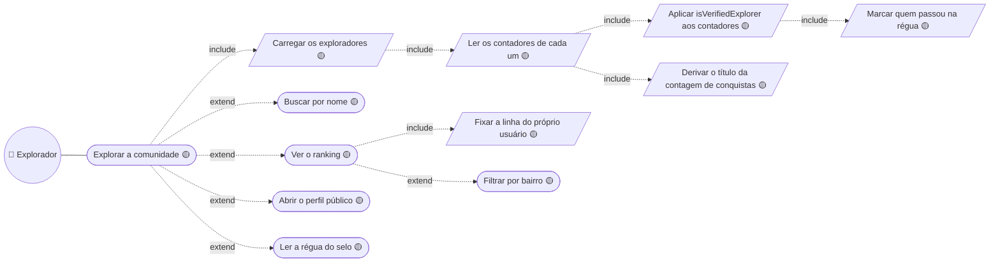
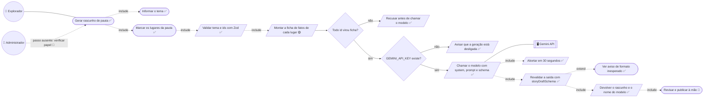
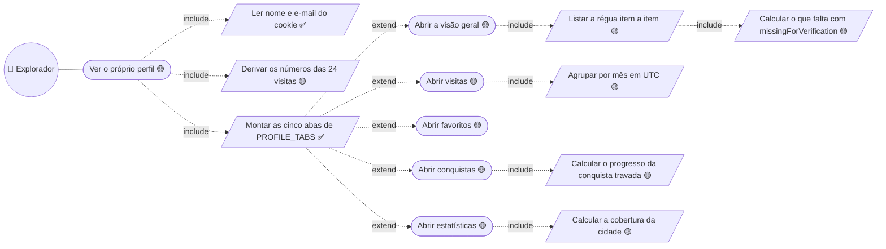

# 04. Comunidade, pauta e perfil — baixo nível

Detalha [03 — Explorador social](../03-explorador-social.md).

## Explorar a comunidade

**A régua é aplicada, não consultada.** `isVerifiedExplorer` é função pura sobre
quatro contadores — ≥5 visitas, ≥3 avaliações publicadas, 0 removidas e ≥1 mês
de conta. Não há coluna de selo em lugar nenhum, então mudar o critério é mexer
em `src/constants/verification.ts` e nada migra junto.

**`Fixar a linha do próprio usuário` existe para o ranking não ser só vitrine:**
placar em que a pessoa não se encontra não diz o que fazer a seguir.

## Gerar rascunho de pauta

**Três defesas, nesta ordem: `Montar a ficha`, a instrução de sistema dentro de
`Chamar o modelo`, e `Revalidar a saída`.** A ordem importa — limitar a entrada,
instruir a conduta, validar a saída. A terceira existe porque as duas primeiras
são pedidos, não garantias: `responseSchema` garante forma, não conteúdo.

**`GEMINI_API_KEY existe?` é decisão, não exceção.** Sem chave a tela funciona e
o gerador avisa que está desligado — ambiente sem a variável é estado esperado.

**`Revisar e publicar à mão` é 🔴** porque não há entidade de pauta: o rascunho
volta para a tela e é copiado à mão. Não existe passo de gravar.

## Ver o próprio perfil

**Cada aba é URL própria, não `useState`.** Conteúdo que se lê, se compartilha e
ao qual se volta precisa de rota — e assim as cinco continuam Server Component,
com `"use client"` só na navegação, que precisa do `usePathname`.

**`Derivar os números das 24 visitas` é o passo que impede divergência.** O
progresso de "visitar 5 cafeterias" conta cafeterias na lista; não é número
digitado. O perfil privado e o público leem a mesma base e não têm como
discordar (`RNF-DAD-13`).

**`Agrupar por mês em UTC` não é preciosismo.** Um dia puro como `2026-08-17` é
meia-noite UTC: formatado no fuso do Brasil vira 16 de agosto, e servidor e
navegador renderizam datas diferentes — hidratação quebrada.

---

## Descrições dos casos

As descrições em template expandido — ator, pré e pós-condição, ações do
ator × ações do sistema numeradas e restrições — vivem em
[`descricoes/04-comunidade-e-perfil.md`](../descricoes/04-comunidade-e-perfil.md): Buscar exploradores, Gerar rascunho de pauta e Ver o próprio perfil.

---

➡️ [05 — Administração](./05-administracao.md)
