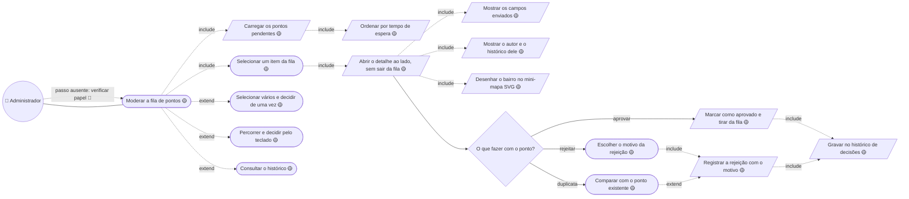
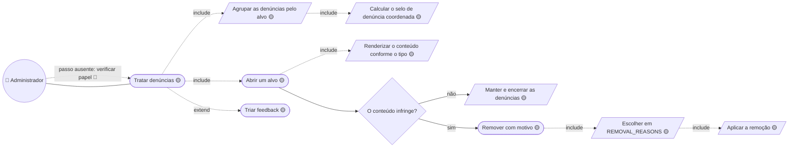
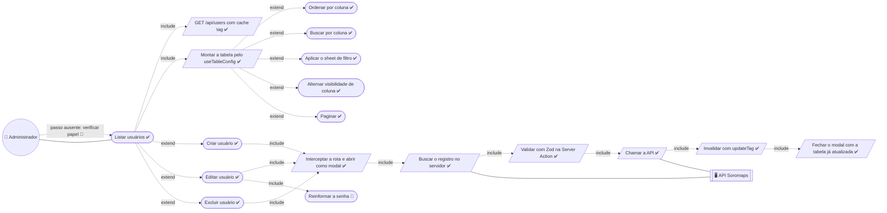

# 05. Administração — baixo nível

Detalha [04 — Administrador](../04-administrador.md).

> ⚠️ Todo diagrama desta página deveria começar por **verificar o papel do
> usuário**. Esse passo não existe: qualquer sessão válida abre `/admin`. Ele
> aparece marcado como ausente, não é omitido.

## Moderar a fila de pontos

**Mestre-detalhe, não tabela mais modal:** aqui a decisão *é* a tela, e abrir
diálogo a cada item custaria um clique por decisão numa atividade que é
repetitiva por natureza. Por isso `Percorrer pelo teclado` é caso de primeira
classe, não conveniência.

**O mini-mapa é SVG, não MapLibre** — instanciar o mapa a cada troca de item na
fila pagaria carregamento de estilo e tiles para mostrar um bairro.

**`Marcar como aprovado` é 🟡 sem contrapartida real:** falta a coluna `status`
em `markers` e a tabela de decisão, então nada sai de fila nenhuma. O ponto
criado em `/places/new` vai direto ao mapa.

## Remover conteúdo denunciado

**`Escolher em REMOVAL_REASONS` é o mesmo passo em `/admin/reviews`.** O
catálogo saiu do mock para `src/constants/content-removal.ts` e o diálogo para
`src/components/blocks/removal-dialog.tsx` justamente para as duas telas não
divergirem no primeiro ajuste de regra — quando a Server Action nascer, ela é
uma só.

## Manter usuários

**`Reinformar a senha` está marcado 🔴 sendo um passo que funciona** porque ele
não deveria existir: `PUT /api/users/{id}` re-hasheia a senha sempre, então
editar o e-mail obriga a redigitar a senha (`RF-ADM-36`).

**`Fechar o modal com a tabela já atualizada` depende do `updateTag`.** No Next
16 o `revalidateTag` exige perfil de cache, e é o `updateTag` que dá
*read-your-own-writes* dentro da action — é o que substituiu o
`router.refresh()` da versão anterior.

---

## Descrições dos casos

As descrições em template expandido — ator, pré e pós-condição, ações do
ator × ações do sistema numeradas e restrições — vivem em
[`descricoes/05-administracao.md`](../descricoes/05-administracao.md): Moderar ponto da fila, Remover conteúdo denunciado, Excluir categoria e Criar usuário.

---

⬅️ [README do baixo nível](./README.md) · ⬆️
[Catálogo de casos](../05-catalogo.md)
