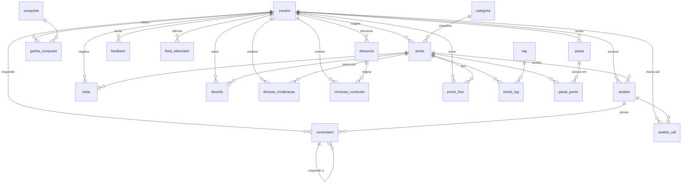

# 🗄️ Modelo de dados — estrutura proposta

> Retrato do banco que as **funcionalidades atuais** exigem. Não é o modelo
> lógico do TCC (esse vive em
> [`archive/wiki-trilha-projetada/05-modelagem-projetada.md`](../../archive/wiki-trilha-projetada/05-modelagem-projetada.md)) nem
> o banco de hoje (esse vive em
> [`wiki/03-banco.md`](../../wiki/03-banco.md)).

O banco real tem **2 tabelas**. As telas já construídas pedem **20**. Esta pasta
é a ponte: cada tabela aqui existe porque alguma tela funcionando hoje sobre
mock precisa dela — nada foi adicionado "para o futuro".

| Arquivo | Conteúdo |
|---|---|
| [`00-schema-completo.dbml`](./00-schema-completo.dbml) | **Fonte de verdade.** As 20 tabelas, enums, índices e notas. Pasteável em [dbdiagram.io](https://dbdiagram.io) |
| [01 — Identidade e acesso](./01-identidade-e-acesso.md) | `usuario`; renomeação de `tbUsuario`, papel, e a convenção de enum |
| [02 — Lugar e catálogo](./02-lugar-e-catalogo.md) | `ponto`, `categoria`, `ponto_foto`, `tag`, `ponto_tag` |
| [03 — Contribuição](./03-contribuicao.md) | `analise`, `analise_util`, `comentario` |
| [04 — Atividade e feed](./04-atividade-e-feed.md) | `visita`, `favorita`, `feed_silenciado` |
| [05 — Gamificação](./05-gamificacao.md) | `conquista`, `ganha_conquista` |
| [06 — Moderação](./06-moderacao.md) | `decisao_moderacao`, `denuncia`, `remocao_conteudo`, `feedback` |
| [07 — Editorial](./07-editorial.md) | `pauta`, `pauta_ponto` |

## 🧭 Convenção desta pasta

- **O `.dbml` é a fonte de verdade do schema.** Os `.md` recortam pedaços dele
  para explicar o porquê; snippet que divergir do `.dbml` está errado. É a
  única exceção à regra "Mermaid é a fonte de verdade dos diagramas" — DBML
  carrega tipo, índice e constraint, que Mermaid não expressa. O mapa abaixo é
  auxílio de leitura, derivado do `.dbml`.
- **Nomenclatura:** `snake_case`, tabela no **singular**, em pt-BR. Resolve as
  três convenções que hoje convivem em duas tabelas (`tbUsuario` × `markers`).
- **Enum no diagrama, `varchar` + `CHECK` na migration** — motivo em
  [01](./01-identidade-e-acesso.md).
- **Toda tabela aqui tem tela.** O que ainda não foi construído
  (`Notificacao`, configurações) fica em [`docs/todo/`](../../todo/README.md),
  não aqui.

## 🗺️ Mapa das relações

> `denuncia` e `remocao_conteudo` têm alvo **polimórfico** (`alvo_tipo` +
> `alvo_id`), então não há linha ligando as duas a `analise`, `comentario`,
> `ponto` e `perfil`. O custo dessa escolha está em [06](./06-moderacao.md).

## 📇 Inventário: tabela → tela → mock que morre

| Tabela | Existe hoje | Tela que a espera | Mock |
|---|---|---|---|
| `usuario` | ✅ como `tbUsuario` | `/admin/users`, sessão | — |
| `categoria` | ❌ | `/admin/categories`, filtros do `/discover` | `admin-categories.ts` |
| `ponto` | 🟡 como `markers` (4 de 15 colunas) | mapa, `/places/*`, `/discover` | `markers.ts` |
| `ponto_foto` | ❌ | `/places/[id]`, moderação | `markers.ts` |
| `tag`, `ponto_tag` | ❌ | filtros e vibes do `/discover` | `markers.ts` |
| `analise` | ❌ | `/admin/reviews`, `/places/[id]`, `/feed` | `admin-reviews.ts` |
| `analise_util` | ❌ | "útil" no `/feed` e em `/community/[id]` | `feed.ts` |
| `comentario` | ❌ | `/admin/reviews` (linha expansível), `/places/[id]` | `admin-reviews.ts` |
| `visita` | ❌ | `/profile/visits`, `/profile/stats`, `/feed` | `profile.ts` |
| `favorita` | ❌ | `/profile/favorites`, motivo `salvo` do feed | `profile.ts` |
| `feed_silenciado` | ❌ | chips de "ver menos disso" no `/feed` | — |
| `conquista` | ❌ | `/admin/achievements` | `admin-achievements.ts` |
| `ganha_conquista` | ❌ | `/profile/achievements`, título do explorador | `profile.ts` |
| `decisao_moderacao` | ❌ | `/admin/moderation` (histórico) | `admin-moderation.ts` |
| `denuncia` | ❌ | `/admin/reports` (fila) | `admin-reports.ts` |
| `remocao_conteudo` | ❌ | `/admin/reports` + `/admin/reviews` | `admin-reports.ts` |
| `feedback` | ❌ | `/admin/reports` (triagem) | `admin-reports.ts` |
| `pauta`, `pauta_ponto` | ❌ | `/pautas/[slug]`, `/community`, card `curadoria` | `stories.ts` |

`/admin/dashboard` não aparece porque não tem tabela própria: ele é agregado
sobre `ponto`, `analise`, `usuario` e `decisao_moderacao` — o
`GET /api/admin/stats` do backlog.

## 🚫 O que ficou de fora, e por quê

| Não entrou | Motivo |
|---|---|
| `Segue` (RF-13) | Feed sem grafo social — [ADR 0002](../../adr/user/0002-feed-sem-grafo-social.md) |
| `tipoUsuario`, `CNPJ`, `UsuarioDono` | Dono de estabelecimento saiu do produto em 2026-08-19 |
| `pontuacao`, `nivel` | Título derivado de `COUNT(ganha_conquista)` — decisão de 2026-08-12 |
| Tabela de feed | Item de feed é consulta, não linha — [04](./04-atividade-e-feed.md) |
| Tabela de sessão | Cookie JWT assinado pelo Next, validado no Edge |
| `Notificacao` | Módulo 💤: não existe rota nem tela |
| Coluna de selo verificado | Função pura sobre contadores; só vira coluna se a consulta doer |
| PostGIS | Entra com busca por raio (RF-11); hoje `(lat, lng)` resolve o bounding box |

## 🚦 Ordem de migração sugerida

Cada passo deixa o sistema em estado utilizável — nenhum exige que o seguinte
exista.

1. **Migrations, antes de qualquer tabela nova.** Hoje o schema é mantido à mão
   em dois lugares (local e Supabase), sem nada que os compare. Criar oito
   tabelas nesse regime multiplica a divergência por quatro.
2. **`usuario`** — renomeação, `UNIQUE`, `papel`. Destrava o gate de `/admin` e
   o de editar/excluir ponto, que são dívida de segurança aberta.
3. **`categoria` + `ponto` expandido + `ponto_foto` + `tag`** — tira
   `/discover`, `/places/*` e `/admin/categories` do mock de uma vez. `status`
   e `autor_id` entram aqui.
4. **`decisao_moderacao`** — com `status` no ponto, `/admin/moderation` passa a
   escrever de verdade.
5. **`analise` + `comentario` + `analise_util`** — o pilar que nunca saiu do
   papel; destrava `/admin/reviews`, a nota do local e metade do `/feed`.
6. **`visita` + `favorita`** — `/profile` inteiro e os motivos do feed.
7. **`conquista` + `ganha_conquista`** — título do explorador e galeria.
8. **`denuncia` + `remocao_conteudo` + `feedback`** — depende de haver conteúdo
   denunciável, então vem depois de 5.
9. **`pauta` + `pauta_ponto` + `feed_silenciado`** — o rascunho do Gemini para
   de ser copiado à mão.

> ⚠️ Nada disso antes da prioridade 0/1 do
> [backlog técnico](../../wiki/09-backlog.md): proxy dos
> markers e **autenticação na API**. Tabela nova sobre API pública aberta só
> aumenta a superfície exposta.
