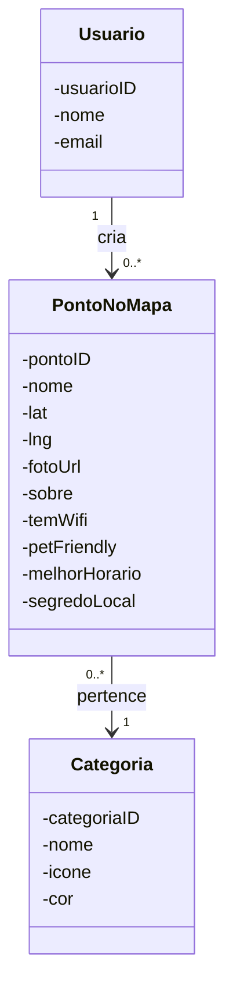

> 🧪 **Proposta.** Conceito aprovado pelo time em **2026-08-03**; nada disso
> existe no banco nem na API ainda. Este arquivo é o spec técnico para quem
> for implementar em `soromaps_api`. Estado real do banco:
> [03 — Banco](../wiki/03-banco.md).

# 📍 Expansão do modelo de Ponto

## Por que

Hoje um ponto no mapa é `id`, `nome`, `lat`, `lng` — quatro colunas. Isso
plota um pin e nada mais: não dá para saber que tipo de lugar é, se cabe
levar o cachorro, se tem tomada e wifi para trabalhar, nem por que alguém
deveria ir lá. O produto se define por "avaliações locais e autênticas dando
visibilidade a estabelecimentos menores", e um pin sem contexto não entrega
isso.

O frontend **já coleta os oito campos** na tela de criar local
(`/places/new`), com validação, exatamente para o time ver o fluxo pronto
antes de mexer no banco. Só `nome`/`lat`/`lng` são enviados — o resto para no
navegador. Implementar esta proposta é o que faz esses campos passarem a
existir de verdade.

---

## 🔄 Antes e depois

| Hoje (`markers`) | Proposto |
|---|---|
| `id`, `nome`, `lat`, `lng` | os mesmos **+ 7 colunas + FK de categoria** |
| Sem tipo de lugar | `categoria_id` → tabela `categorias` |
| Sem foto | `foto_url` |
| Sem contexto nenhum | `sobre`, `melhor_horario`, `segredo_local` |
| Sem filtro possível | `tem_wifi`, `pet_friendly` |

---

## 🧱 Os campos

Nomenclatura deliberadamente mais solta que a do modelo do TCC
(`PontoDescricao`, `PontoContato`) — o produto fala com o usuário em tom de
recomendação entre amigos, e o schema pode acompanhar. `sobre` em vez de
`descricao`, `segredo_local` em vez de `observacoes`.

| Campo na tela | Coluna | Tipo | Obrigatório | Observação |
|---|---|---|---|---|
| Foto do local | `foto_url` | `varchar(500)` | sim | Guarda **só a URL**. Onde a imagem fica hospedada é decisão separada — não há infra de upload no projeto (RF-08) |
| Nome do local | `nome` | `varchar(120)` | sim | Já existe |
| Descrição breve | `sobre` | `varchar(160)` | sim | Limite curto de propósito: é chamada, não resenha. Avaliação longa é `Analise`, outra entidade |
| Categoria / vibe | `categoria_id` | `int` FK | sim | **FK, não enum** — ver decisão abaixo |
| Tem wifi | `tem_wifi` | `boolean` | sim (default `false`) | — |
| É petfriendly | `pet_friendly` | `boolean` | sim (default `false`) | — |
| Melhor horário para visitar | `melhor_horario` | `varchar(60)` | **não** | Texto livre (`"fim de tarde"`, `"evita o almoço"`), não enum de período — a informação útil raramente cabe numa faixa de horário |
| Segredo local | `segredo_local` | `varchar(200)` | **não** | O "peça o café da casa, não está no cardápio". É o campo mais alinhado à ideia de avaliação autêntica |

`created_at`/`updated_at` entram junto, como já existe em `tbUsuario`.

---

## 🗺️ DER

Fonte em [`2026-08-03-modelo-ponto.dbml`](./2026-08-03-modelo-ponto.dbml) —
cole em [dbdiagram.io](https://dbdiagram.io) para visualizar e iterar.

**Por que dbdiagram.io e não Mermaid**, se o projeto adotou Mermaid como
fonte de verdade: enquanto o modelo está em discussão, arrastar coluna e ver
a FK render em tempo real vale mais que diff legível. Quando for
implementado, o modelo migra para Mermaid em
[`05 — Modelagem projetada`](../archive/wiki-trilha-projetada/05-modelagem-projetada.md) e volta à
fonte única. O `.dbml` é rascunho, não substituto.

---

## 🧩 UML — classe `PontoNoMapa` atualizada

Recorte do diagrama conceitual de
[`05 — Modelagem projetada`](../archive/wiki-trilha-projetada/05-modelagem-projetada.md), com o que
esta proposta acrescenta:

> A seta `Usuario --> PontoNoMapa` está no diagrama porque é o desenho
> original do TCC, mas a FK `usuario_dono` **não** faz parte desta proposta —
> ver "Em aberto".

---

## 🧭 Decisões desta proposta

### Categoria é FK para tabela própria, não enum/coluna de texto
**Decisão:** criar a tabela `categorias` (`id`, `nome`, `icone`, `cor`) e
referenciá-la em `markers.categoria_id`.
**Motivo:** o valor da categoria não é o rótulo, é o **ícone e a cor** — é o
que torna o mapa legível de relance, com pin diferente por tipo. Enum não
carrega ícone nem cor, e mudar a lista viraria migration a cada categoria
nova. O módulo `/admin/categories` já está desenhado
([`docs/todo/admin/categories.md`](../todo/admin/categories.md)) e é apontado
lá como "o primeiro módulo a fazer" — **esta proposta pede para puxá-lo
junto**, porque sem ele o campo de categoria fica com lista fixa no código
(que é exatamente o placeholder que o formulário usa hoje).

### Amenidades como colunas booleanas, por enquanto
**Decisão:** `tem_wifi` e `pet_friendly` como `boolean` em `markers`.
**Motivo:** duas amenidades não justificam tabela associativa — booleano é
mais simples de consultar e de filtrar. **Limite explícito:** se a lista
crescer (estacionamento, acessibilidade, aceita pix, tem tomada…), o caminho
é uma tabela `amenidades` + associativa, no mesmo molde de `categorias`.
Acumular uma coluna booleana por amenidade não escala e transforma cada
adição em migration.

### `sobre` com 160 caracteres
**Decisão:** limite curto e rígido, validado no front e no banco.
**Motivo:** separa claramente "chamada do lugar" de "avaliação", que é a
entidade `Analise` do modelo do TCC (RF-07/RF-12) e ainda não existe. Sem o
limite, `sobre` viraria o lugar onde as pessoas escrevem resenha, e a
`Analise` nasceria morta.

---

## ❓ Em aberto — o time ainda precisa decidir

| Questão | Por que importa |
|---|---|
| **`usuario_dono` (FK para `tbUsuario`)** | Sem isso não existe permissão: hoje qualquer sessão edita ou apaga qualquer ponto. Está no backlog de segurança e depende de a API ganhar autenticação primeiro |
| **`status` (moderação)** | Só faz sentido se pontos criados por usuário comum passarem por aprovação. Muda o fluxo da tela e pede um `/admin/moderation` |
| **Nomenclatura das tabelas** | `markers` (inglês) × `tbUsuario` (prefixo `tb` + português) × colunas em `snake_case` misto. Três convenções em duas tabelas — vale padronizar **antes** de criar `categorias` e as próximas. Já registrado em [03 — Banco](../wiki/03-banco.md) |

---

## 🛠️ O que precisa mudar quando for implementado

Nada abaixo foi feito — é a lista de trabalho da implementação.

**No repo da API (`soromaps_api`):**
- `Models/Marker.cs` — as 7 propriedades novas + `CategoriaId`
- `Models/Categoria.cs` — model novo
- `DTO/MarkerDTO.cs` — campos novos no payload de entrada
- `Controllers/CategoriasController.cs` — CRUD, idêntico ao de markers
- **Migration** — e aqui está o problema: o projeto **não tem `Migrations/`**,
  o schema é mantido à mão em dois lugares (local e Supabase), sem nada que
  os compare. Esta é uma boa oportunidade para introduzir EF Core Migrations
  antes de o schema dobrar de tamanho — ver
  [03 — Banco](../wiki/03-banco.md)
- Decidir onde a foto é hospedada (Supabase Storage é o candidato óbvio, já
  que o banco está lá) e por onde o upload passa

**No repo do front (`soromaps_web`):**
- `src/types/marker.ts` — `MarkerResource` ganha os campos
- `src/validations/markers.ts` — mover para lá o schema de protótipo que hoje
  vive em `places/new/_components/create-marker-form.tsx`
- `src/actions/markers.ts` — parar de descartar os campos no `FormData`
- `create-marker-form.tsx` — trocar a lista fixa `VIBE_OPTIONS` por categorias
  vindas da API
- Popup do marcador — hoje só edita o nome; passa a editar o resto

**Na documentação:**
- [`05 — Modelagem projetada`](../archive/wiki-trilha-projetada/05-modelagem-projetada.md) — modelo em
  Mermaid, convertido do `.dbml`
- [`03 — Banco`](../wiki/03-banco.md) — schema real
- [`09 — Backlog`](../wiki/09-backlog.md) — recalcular o gap
- `CLAUDE.md` — decisão registrada
- Esta proposta sai de `docs/propostas` para `docs/archive`
