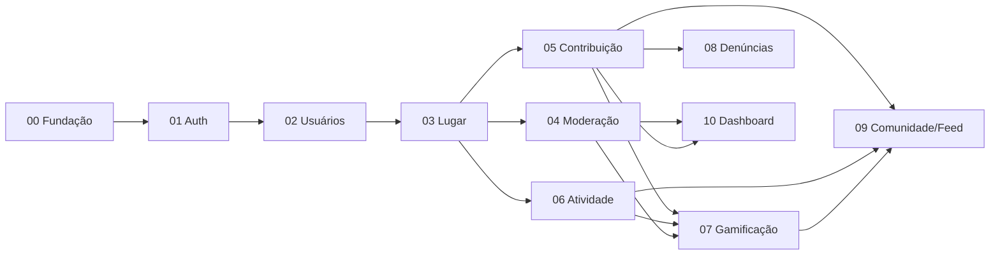

# 🛠️ TODO — roadmap da API

> Caminho definido em **2026-09-15** para a API alimentar o front
> (`soromaps_web`). Nada aqui está implementado: é a ordem de trabalho e as
> decisões que a sustentam. Decisões com motivo em [`decisoes.md`](./decisoes.md).

O front correu à frente do banco de propósito: as telas foram construídas
inteiras sobre `src/mocks/*` antes de existir schema. Hoje só login, CRUD de
usuários e `nome`/`lat`/`lng` de ponto usam dado real. A API tem duas tabelas
(`tbUsuario`, `markers`), nenhum endpoint autenticado, nenhuma migration e três
formatos de erro diferentes.

Cada fase entrega **migration + endpoint + tela saindo do mock** juntos, e
deixa o sistema utilizável — nenhuma exige que a seguinte exista.

---

## 📐 Convenção de status

| Status | Significado |
|---|---|
| 💤 | Não iniciada |
| 🔨 | Em desenvolvimento |
| 🟡 | Parcial |
| ✅ | Entregue |

Regra: concluiu uma fase → atualiza o status aqui e no `.md` dela **na mesma
entrega**, e registra no `CLAUDE.md` o que mudou de decisão.

---

## 🚦 Fases

| # | Fase | Status | Destrava no front | Mock que sai |
|---|---|---|---|---|
| 00 | [Fundação](./00-fundacao.md) | 💤 | Base para tudo: migrations, schemas, seed, config, contrato de erro | — |
| 01 | [Autenticação](./01-autenticacao.md) | 💤 | API deixa de ser pública; gate de `/admin` real | — |
| 02 | [Usuários](./02-usuarios.md) | 💤 | `/settings`, papel de admin, perfil | — |
| 03 | [Lugar e catálogo](./03-lugar-e-catalogo.md) | 💤 | `/discover`, `/places/*`, `/admin/categories`, fotos | `markers.ts`, `admin-categories.ts` |
| 04 | [Moderação de ponto](./04-moderacao.md) | 💤 | `/admin/moderation` | `admin-moderation.ts` |
| 05 | [Contribuição](./05-contribuicao.md) | 💤 | `/admin/reviews`, avaliações em `/places/[id]` | `admin-reviews.ts` |
| 06 | [Atividade](./06-atividade.md) | 💤 | `/profile/*` | `profile.ts` |
| 07 | [Gamificação](./07-gamificacao.md) | 💤 | `/profile/achievements`, `/admin/achievements`, título do explorador | `admin-achievements.ts` |
| 08 | [Denúncias e feedback](./08-denuncias-e-feedback.md) | 💤 | `/admin/reports` | `admin-reports.ts` |
| 09 | [Comunidade, feed e pautas](./09-comunidade-feed-pautas.md) | 💤 | `/community`, `/feed`, `/pautas/[slug]` | `feed.ts`, `community.ts`, `stories.ts` |
| 10 | [Dashboard](./10-dashboard.md) | 💤 | `/admin/dashboard` | `admin-dashboard.ts` |

---

## ⚠️ Alertas abertos

- [ ] **Trocar a senha do Supabase.** `appsettings.Development.json` foi versionado com ela em texto puro; o arquivo saiu do git, mas a senha continua no histórico. Com a [D13](./decisoes.md#d13--configuração-via-dotnetenv), segredo passa a morar só no `.env`
- [ ] **Traduzir o modelo de dados para as decisões tomadas.** O `.dbml` de 20 tabelas (`docs/diagramas/modelo-de-dados/`, removido do disco em 2026-09 — recuperável pelo histórico, commit `3dd97fa`) está em pt-BR singular e diz "sem tabela de sessão". Precisa refletir: inglês `snake_case` plural ([D3](./decisoes.md#d3--nomes-inglês-snake_case-no-banco-pascalcase-no-c-camelcase-no-json), [D12](./decisoes.md#d12--tabelas-no-plural)), tabela `sessions` ([D1](./decisoes.md#d1--autenticação-a-api-emite-o-next-cifra)), schemas `soromaps`/`soromaps_dev` ([D5](./decisoes.md#d5--dois-schemas-no-mesmo-projeto-supabase))
- [ ] **Remover menções ao app Expo** ([D10](./decisoes.md#d10--sem-app-expo)): `CLAUDE.md` do front (stack e backlog), wiki `09-backlog.md` item 30, `CLAUDE.md` desta API

---

## 🔗 Fora da API, mas bloqueia

- **`/api/proxy/[...path]` no Next** — P0, o mapa não carrega marcadores em produção. É o que permite remover o CORS ([D11](./decisoes.md#d11--sem-cors)); a contrapartida na API é o `bbox` da [fase 03](./03-lugar-e-catalogo.md)

---

## 📚 Referências

| O quê | Onde |
|---|---|
| Modelo de dados (20 tabelas, pt-BR) | Histórico git: `git show 3dd97fa:docs/diagramas/modelo-de-dados/00-schema-completo.dbml` |
| Proposta do ponto (2026-08-03) | `soromaps_web/docs/propostas/2026-08-03-expansao-modelo-ponto.md` |
| Backlog técnico do produto | `soromaps_web/docs/wiki/09-backlog.md` |
| Módulos de tela pendentes | `soromaps_web/docs/todo/README.md` |
| Sessão atual do front | `soromaps_web/src/lib/session.ts`, `src/middleware.ts`, `src/actions/auth.ts` |
| Contrato de leitura do front | `soromaps_web/src/http/{users,markers}/*.ts` |
