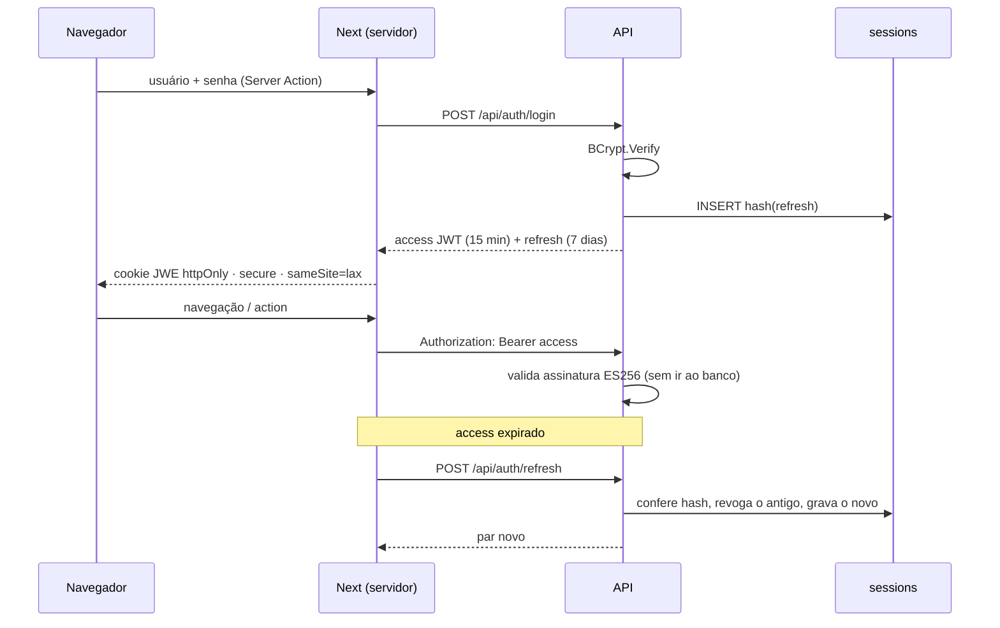
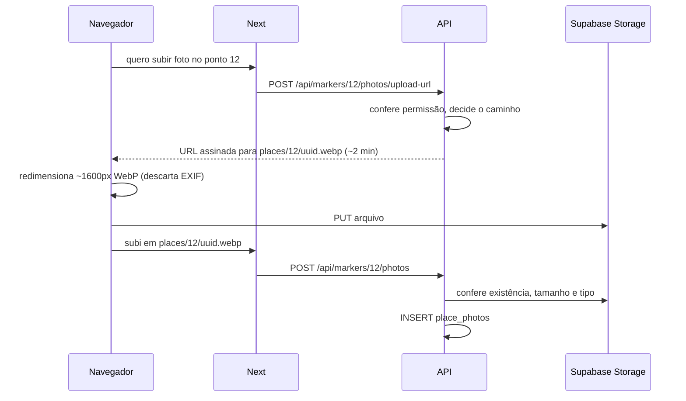

# 🧭 Decisões do roadmap da API

> Tomadas em **2026-09-15**, antes de qualquer implementação. Cada uma com o
> motivo e o que foi descartado. Voltar ao [índice](./README.md).

| # | Decisão | Fase |
|---|---|---|
| [D1](#d1--autenticação-a-api-emite-o-next-cifra) | Autenticação: a API emite, o Next cifra | 01 |
| [D2](#d2--reset-limpo-do-banco) | Reset limpo do banco | 00 |
| [D3](#d3--nomes-inglês-snake_case-no-banco-pascalcase-no-c-camelcase-no-json) | Inglês `snake_case` no banco, `PascalCase` no C#, `camelCase` no JSON | 00 |
| [D4](#d4--fotos-por-url-assinada) | Fotos por URL assinada | 03 |
| [D5](#d5--dois-schemas-no-mesmo-projeto-supabase) | Dois schemas no mesmo Supabase | 00 |
| [D6](#d6--só-supabase-sem-postgres-local) | Só Supabase, sem Postgres local | 00 |
| [D7](#d7--seed-a-partir-dos-mocks-do-front) | Seed a partir dos mocks do front | 00 |
| [D8](#d8--primeiro-admin-via-configuração) | Primeiro admin via configuração | 00 |
| [D9](#d9--erro-em-problemdetails-com-code-texto-no-front) | Erro em ProblemDetails com `code`; texto no front | 00 |
| [D10](#d10--sem-app-expo) | Sem app Expo | — |
| [D11](#d11--sem-cors) | Sem CORS | 00 |
| [D12](#d12--tabelas-no-plural) | Tabelas no plural | 00 |
| [D13](#d13--configuração-via-dotnetenv) | Configuração via DotNetEnv | 00 |

---

## D1 — Autenticação: a API emite, o Next cifra

**Decisão:** a API é a autoridade de identidade. Ela confere a senha (BCrypt) e
emite um **access token JWT ES256 de 15 minutos** e um **refresh token
aleatório de 7 dias**, cujo hash SHA-256 fica na tabela `sessions`. O Next
guarda os dois num **cookie JWE** (`A256GCM`, lib `jose`), renova pelo refresh
no `middleware.ts` e envia `Authorization: Bearer` à API. A API valida todo
request com `AddJwtBearer`. Inclui "sair de todos os dispositivos".



**Motivo.** Hoje o Next assina um JWT HS256 escrito à mão e a API **não sabe
que sessão existe**: quem tiver a URL chama qualquer endpoint. Além disso:

- o payload é legível (JWT assinado garante integridade, não sigilo);
- `exp` está em milissegundos, fora do padrão (segundos), então a API .NET nem
  conseguiria validar esse token;
- não há revogação: token de 7 dias vale 7 dias, mesmo após perder o papel de
  admin ou fazer logout em outro lugar;
- o código de cripto à mão não confere `alg`, `nbf` nem `iat`.

**O que cada peça resolve:**

| Peça | Resolve |
|---|---|
| API valida o JWT | A URL da API deixa de ser a proteção; sem token assinado nada passa |
| **ES256** (assimétrico) | A chave privada fica só na Azure; a Vercel tem só a pública. Vazar as variáveis da Vercel **não permite forjar token de admin** |
| Access de 15 min | Token roubado ou papel retirado deixa de valer em até 15 min |
| Refresh com hash no banco | Revogável (logout, logout-all). Banco vazado não entrega tokens usáveis — mesmo princípio da senha |
| Rotação do refresh | Cada uso gera um par novo e mata o anterior |
| Cookie **JWE** | Conteúdo cifrado: nada legível em log, proxy, extensão ou máquina compartilhada. Camada extra — o `httpOnly` já impedia JavaScript de ler |
| `sameSite=lax` | Cookie vai em navegação por link (GET de topo), não em POST/fetch/iframe vindos de outro site: bloqueia CSRF sem deslogar quem chega por link externo |

**Paralelo com Laravel:** `sessions` é o equivalente ao
`personal_access_tokens` do Sanctum (hash do token, expiração, revogação). A
diferença é que o Sanctum consulta o banco **a cada request**; aqui o access é
validado só pela assinatura, e o banco é consultado a cada ~15 min, no refresh.

**Ajustes no BCrypt que já existe:** custo 12 explícito; rehash no login se o
custo mudar; senha limitada a 72 bytes (o BCrypt ignora o excedente, e duas
senhas diferentes virariam a mesma); `Verify` contra hash falso quando o
usuário não existe, para o tempo de resposta não denunciar a existência da
conta; mensagem genérica e rate limit no login.

**Descartado:**
- *Next emite HS256, API valida com segredo compartilhado* — mais simples, mas
  sem revogação, e vazar o segredo da Vercel permite forjar qualquer papel.
- *Token opaco consultado a cada request (estilo Sanctum puro)* — revogação
  instantânea, ao custo de uma ida ao banco por request e sem validação no Edge.
- *Detecção de reuso de refresh* (revogar tudo se um refresh já usado
  reaparecer) — fica para depois; a rotação simples já cobre o caso comum.

**Custos aceitos:** três segredos (chave privada na Azure; pública e chave JWE
na Vercel); tabela `sessions`, que contradiz a nota "sem tabela de sessão" do
modelo de dados; lógica de refresh. Reverte a decisão de 2026-07-28 do front
("`crypto.subtle` sem biblioteca de JWT") — registrar no `CLAUDE.md` do front
quando implementar.

---

## D2 — Reset limpo do banco

**Decisão:** `tbUsuario` e `markers` são descartadas. As tabelas nascem do
zero, pelas migrations, com os nomes novos. Sem migration de baseline e sem
`RENAME`.

**Motivo:** não há dado real a preservar, e preservar obrigaria a uma baseline
sobre um schema criado à mão e a renomear tabela e coluna em produção. Começar
limpo é o momento mais barato para o ORM passar a ser a única fonte da
estrutura.

**Descartado:** baseline + `RENAME` — só se justificaria com usuários reais.

---

## D3 — Nomes: inglês `snake_case` no banco, `PascalCase` no C#, `camelCase` no JSON

**Decisão:** banco em inglês `snake_case` (`places.has_wifi`), classes em
`PascalCase` (`Place.HasWifi`), JSON em `camelCase` (`"hasWifi"`). O pacote
`EFCore.NamingConventions` com `UseSnakeCaseNamingConvention()` converte
tabelas, colunas, PKs, FKs e índices sozinho; o `System.Text.Json` já produz
`camelCase` por padrão.

**Motivo:** hoje há três convenções em duas tabelas (`tbUsuario`, `markers`,
`user_name` × `nome`). Manter o banco em pt-BR com código em inglês exigiria
`[Table]`/`[Column]` escritos à mão em ~150 propriedades, como `User.cs` já
faz. Com o banco em inglês, **nenhum mapeamento manual**, e as três camadas
seguem a convenção natural de cada uma.

**Descartado:** banco em pt-BR (modelo `.dbml` como está). **Custo aceito:** o
`.dbml` e os capítulos do modelo de dados precisam ser traduzidos.

---

## D4 — Fotos por URL assinada

**Decisão:** o arquivo vai **direto do navegador para o Supabase Storage**, por
URL assinada gerada pela API. O banco guarda só a URL em `place_photos`.



**Motivo:** a alternativa (bytes pelo Next e pela API) esbarra no limite de
**4,5 MB** de corpo das funções da Vercel e de **1 MB** padrão das Server
Actions — foto de celular tem 3 a 8 MB —, e trafega os mesmos bytes duas vezes.
Pela URL assinada:

- sem limite de tamanho da Vercel e sem banda dobrada;
- a URL da API continua secreta (o navegador só fala com o Next e o Supabase);
- a API decide o caminho, então ninguém sobrescreve foto alheia;
- o redimensionamento no navegador recodifica a imagem e **descarta o EXIF**,
  que pode carregar o GPS de onde a foto foi tirada.

**Regras que vêm junto:**
- **Bucket privado**, leitura por URL assinada: foto de ponto `pending` não
  pode ser pública antes da moderação;
- **Limpeza de órfãos**: objeto sem linha em `place_photos` há mais de 24 h é
  apagado (quem fecha a aba entre o upload e a confirmação);
- chave de serviço do Supabase só na API.

**Descartado:** upload passando pela API — controle total na validação, mas
quebra no limite da Vercel sem compressão prévia.

---

## D5 — Dois schemas no mesmo projeto Supabase

**Decisão:** `soromaps_dev` para desenvolvimento e `soromaps` para produção, no
mesmo projeto. A API escolhe por `Database__Schema`
(`HasDefaultSchema`, incluindo `__EFMigrationsHistory`).

**Motivo:** sem Postgres local ([D6](#d6--só-supabase-sem-postgres-local)), dev
e prod usariam o mesmo banco, e três coisas dariam errado: um `db:fresh` para
testar migration apagaria produção; o seed de demonstração apareceria para
usuários reais; dois devs resetariam o banco um do outro. Schema separado isola
isso sem segundo projeto.

**Regras:**
- `db:fresh` e seed de demonstração **só** em `soromaps_dev` — o comando recusa
  qualquer outro schema;
- `soromaps` só recebe migration aplicada deliberadamente
  (`migrations script --idempotent` revisado + `dotnet ef database update`);
- fresh é `DROP SCHEMA soromaps_dev CASCADE`, **nunca** `database drop`: o
  banco `postgres` do Supabase contém `storage`, `auth` e `realtime`, e
  derrubá-lo derruba o projeto.

**Descartado:** dois projetos Supabase (isolamento total, inclusive do Storage,
mas duas connection strings e dois painéis).

---

## D6 — Só Supabase, sem Postgres local

**Decisão:** não há banco local; todo desenvolvimento aponta para o Supabase,
no schema `soromaps_dev`.

**Motivo:** um ambiente só para configurar e o mesmo Postgres que produção
usa, com a mesma versão, extensões e pooler. O risco de compartilhar banco com
produção é resolvido pela [D5](#d5--dois-schemas-no-mesmo-projeto-supabase).

**Consequência:** conexão sempre pelo **session pooler** (IPv4) — ver a decisão
de 2026-08-16 no `CLAUDE.md` desta API.

---

## D7 — Seed a partir dos mocks do front

**Decisão:** os dados de `soromaps_web/src/mocks/*` viram a semente do banco,
em dois mecanismos:

| Tipo de dado | Mecanismo | Ambiente |
|---|---|---|
| Catálogo fixo: `categories`, `tags`, `achievements` | `HasData` (entra na migration) | dev e prod |
| Demonstração: usuários, pontos, avaliações, visitas | `DatabaseSeeder` (código, fora da migration) | só `soromaps_dev` |

**Motivo:** as telas já foram desenhadas sobre esses dados. Semeá-los faz o
front sair do mock sem abrir tela vazia, e mantém apresentações e
desenvolvimento com o mesmo conteúdo que o time já conhece.

**Paralelo com Laravel:** `dotnet run -- db:fresh --seed` ≈ `migrate:fresh
--seed`; `DatabaseSeeder` ≈ `DatabaseSeeder`; `HasData` ≈ insert fixo dentro da
migration; o JSON exportado dos mocks faz o papel das factories.

**Regras:**
- Um script no front exporta os mocks para JSON **versionado na API**; o C# não
  importa TypeScript, e transcrever à mão erraria.
- **Agregado não é semeado.** `nota`, `totalAvaliacoes`, `relevancia` e
  `obtencoes` do mock não viram coluna: o seeder cria as linhas que produzem
  esses números (ex.: 23 avaliações determinísticas cuja média dá 4.6).
- `HasData` exige id fixo, e id explícito **não avança a sequence** do
  Postgres: a identity começa em 1000 (`HasIdentityOptions(startValue: 1000)`),
  senão o primeiro `INSERT` pela API colide no id 1.

**Descartado:** transcrever os mocks para C# à mão; semear demo em produção.

---

## D8 — Primeiro admin via configuração

**Decisão:** o seeder cria um admin a partir de `Seed__AdminEmail` e
`Seed__AdminPassword` **somente se ainda não existir usuário com `role =
admin`**. Roda em qualquer schema. Depois do primeiro boot, a senha sai da
configuração.

**Motivo:** hash de senha dentro de migration ou de JSON versionado fica no git
para sempre. Pela configuração, o valor existe só no `.env` local ou nas App
Settings da Azure.

**Descartado:** admin em `HasData`; promover usuário comum por SQL manual
(funciona, mas não é reproduzível após um fresh).

---

## D9 — Erro em ProblemDetails com `code`; texto no front

**Decisão:** toda resposta de erro da API segue o ProblemDetails (RFC 7807),
nativo do ASP.NET (`AddProblemDetails` + `UseExceptionHandler`), com duas
extensões:

```json
{
  "status": 409,
  "title": "Conflict",
  "detail": "Email already in use.",
  "code": "user.email_taken",
  "errors": { "email": ["user.email_taken"] }
}
```

O **front** mapeia `code` para a mensagem em pt-BR num dicionário próprio, com
**mensagem padrão** quando o `code` não existe, o corpo não é JSON ou a API não
respondeu. O corpo da API **nunca** é exibido cru.

**Motivo:** hoje convivem três formatos:
1. texto puro (`Unauthorized("Senha incorreta")`), que `loginAction` exibe
   direto via `response.text()`;
2. ProblemDetails automático do `[ApiController]` na validação — que
   `registerAction` mostra **como JSON cru, em inglês, no toast** (bug atual);
3. exceção não tratada virando 500 genérico — e-mail duplicado não teria como
   virar "esse e-mail já está em uso".

`code` estável permite ao front decidir sem comparar texto; `errors` por campo
alimenta o `setError` do React Hook Form. Texto no front significa ajustar uma
frase sem deploy da API.

**Status usados:**

| Status | Quando |
|---|---|
| `400` | Validação falhou (`errors` por campo) |
| `401` | Sem token, token inválido ou expirado → front tenta refresh, senão `/login` |
| `403` | Autenticado, sem permissão (explorador em rota admin) |
| `404` | Não existe, ou pauta em rascunho |
| `409` | Conflito com o estado atual: `UNIQUE` violado (`PostgresException.SqlState == "23505"`, o nome da constraint indica o campo), ponto já decidido por outro moderador, categoria excluída sem reatribuição |
| `500` | Bug — sem stack trace em produção |

**Descartado:** formato próprio `{ message }` — mais código para manter e
divergente da validação automática do ASP.NET.

---

## D10 — Sem app Expo

**Decisão:** não haverá app mobile. A API serve só o front web.

**Consequência:** some qualquer razão para CORS ou para token entregue a
cliente não-navegador ([D11](#d11--sem-cors)). Menções ao Expo a remover:
`CLAUDE.md` do front (stack e backlog), wiki `09-backlog.md` (item 30) e
`CLAUDE.md` desta API.

---

## D11 — Sem CORS

**Decisão:** a política de CORS sai do `Program.cs`, em produção e em
desenvolvimento.

**Motivo:** CORS é regra **do navegador**: só se aplica quando JavaScript de
uma origem chama outra origem. Chamada servidor→servidor (Server Action,
`src/http`) não passa por ele. Hoje o único chamador pelo navegador é
`use-markers.ts`; com a `/api/proxy` do Next, **nenhum navegador chama a API**,
e sem Expo não há outro cliente.

**Sobre segurança:** CORS não protege a API — `curl` e scripts o ignoram; quem
protege é a [D1](#d1--autenticação-a-api-emite-o-next-cifra). Uma lista de
origens permitidas **não** é insegura (é a forma restritiva, e o navegador não
deixa JavaScript falsificar o header `Origin`). Inseguro seria
`AllowAnyOrigin`/`SetIsOriginAllowed(_ => true)` com credenciais, curinga de
domínio compartilhado (`*.vercel.app` libera qualquer projeto da Vercel) ou
aceitar `Origin: null`. Sem política nenhuma, não há lista para errar.

**Pré-requisito:** a `/api/proxy/[...path]` no Next precisa existir antes, ou o
mapa deixa de funcionar também em dev.

---

## D12 — Tabelas no plural

**Decisão:** `users`, `places`, `place_photos`, `sessions`. O nome vem da
propriedade `DbSet` (`DbSet<Place> Places` → `places`).

**Motivo:** convenção mais comum no ecossistema (Laravel, Rails) e a que o EF
produz naturalmente. **Descartado:** singular, como o `.dbml` original.

---

## D13 — Configuração via DotNetEnv

**Decisão:** configuração no estilo Laravel: `.env` ignorado pelo git,
`.env.example` versionado, carregados pelo pacote `DotNetEnv` na primeira linha
do `Program.cs`:

```csharp
DotNetEnv.Env.NoClobber().TraversePath().Load();
var builder = WebApplication.CreateBuilder(args);
```

```dotenv
# .env.example
ConnectionStrings__DefaultConnection=
Database__Schema=soromaps_dev
Auth__PrivateKey=
Seed__AdminEmail=
Seed__AdminPassword=
Supabase__ServiceKey=
```

**Como funciona:**
- `__` vira `:` na configuração do .NET: `ConnectionStrings__DefaultConnection`
  é lida por `GetConnectionString("DefaultConnection")` sem código extra. **São
  os mesmos nomes das Application Settings da Azure.**
- `NoClobber()`: variável que já existe no ambiente não é sobrescrita pelo
  `.env`; em produção não há `.env` e a Azure manda.
- Variável de ambiente tem precedência sobre `appsettings.json`, que fica
  versionado só com o que não é segredo.
- O `.gitignore` já cobre (`.env*` + `!.env.example`). Clonar sem `.env` sobe a
  API; ela só falha ao tocar o banco, como um Laravel sem `.env`.

**Motivo:** familiaridade do time (vindo de Laravel) e um lugar só para
segredo. Foi `appsettings.Development.json` — pensado para ser versionado — que
vazou a senha do Supabase.

**Descartado:** User Secrets (`dotnet user-secrets`) + `appsettings.Development.json`,
o caminho nativo do .NET.
