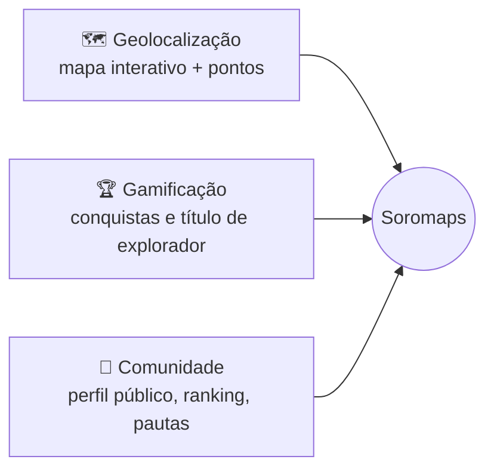
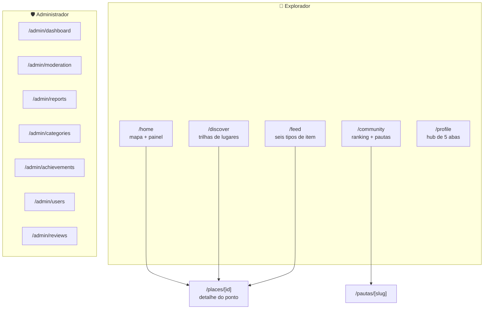

# 🌆 01. Visão geral

O Soromaps é uma plataforma para **descobrir, avaliar e compartilhar
experiências em lugares de Sorocaba**. A aposta central: avaliação feita por
quem mora na cidade vale mais que avaliação genérica de plataforma global.

Os três pilares seguem de pé, mas dois deles não são mais o que o desenho
original previa. A diferença está descrita abaixo, e o motivo de cada corte
está em [`/CLAUDE.md`](../../CLAUDE.md) na data indicada.

---

## 🧭 Os três pilares, como estão hoje

### 🗺️ Geolocalização — o único com persistência

Mapa MapLibre em tela cheia é a tela principal (`/home`), com painel arrastável
por cima. Ponto no mapa é a única entidade de produto que existe no banco, e
criar/editar/excluir ponto funciona ponta a ponta.

O foco geográfico é literal: o viewport inicial é fixo em Sorocaba
(`-23.472, -47.446`), em [`src/constants/map.ts`](../../src/constants/map.ts).
Escopo restrito a uma cidade viabiliza densidade de conteúdo com base pequena
de usuários — que é a condição de um TCC.

### 🏆 Gamificação — conquista, sem XP

**Não existe pontuação nem nível.** O pilar fica só com conquista
(`Conquista` + `GanhaConquista`), e a hierarquia visível ao lado do nome é um
**título derivado da contagem de conquistas** — função pura, sem coluna, sem
curva, sem ledger:

`0–2 Novato · 3–6 Explorador · 7–12 Guia local · 13+ Veterano`
([`src/constants/explorer-titles.ts`](../../src/constants/explorer-titles.ts))

Conquista é estado idempotente: errar o critério e reprocessar é seguro. XP é
acumulador — conceder duas vezes deixa o saldo errado para sempre. Decisão de
12/08/2026.

### 👥 Comunidade — sem grafo social

**Não existe seguir, seguidor nem feed de quem você segue.** O que a plataforma
tem no lugar:

| Peça | Rota | O que faz |
|---|---|---|
| Feed por vínculo com lugar | `/feed` | Todo item entra por um dos cinco motivos — `perto`, `salvo`, `categoria`, `cidade`, `curadoria` — e o motivo aparece no card |
| Perfil público | `/community/[id]` | Vitrine de contribuição: "dá para confiar nessa pessoa?" |
| Ranking de contribuição | `/community` | Geral e por bairro, com a linha do próprio usuário fixa |
| Selo de explorador verificado | `/community`, `/profile` | Régua objetiva publicada na tela, não chancela manual |
| Pautas | `/pautas/[slug]` | Texto editorial ancorado em lugares, redigido pelo Gemini e publicado só depois de revisão humana |

Feed de grafo abre **vazio** para quem chegou agora, e seguir arrastaria
bloqueio, perfil privado e denúncia de perseguição para o escopo. Os cinco
motivos saem de dados que o produto precisa de qualquer jeito. Decisão de
17/08/2026.

---

## ✂️ O que saiu do escopo

| Cortado | Quando | Em uma linha |
|---|---|---|
| `Segue` / rede social (RF-13) | 17/08/2026 | Custo de moderação e cold start desproporcionais; o eixo do produto é lugar, não gente |
| Dono de estabelecimento (`business/*`, `/admin/businesses`) | 19/08/2026 | Evita CNPJ, distinção pessoa física/jurídica e fluxo de reivindicação — a maior peça de modelagem não paga |
| `pontuacao` / `nivel` | 12/08/2026 | XP é acumulador não reprocessável; título derivado entrega a mesma sensação de graça |
| Telas `/visits`, `/favorites`, `/stats`, `/achievements` | 19/08/2026 | Respondiam à mesma pergunta ("o que eu já fiz?") — viraram abas de `/profile` |
| `/places` como vitrine | 17/08/2026 | Fundiu em `/discover`; `/places` sobrou só como prefixo de `[id]` e `new` |

**A régua que ficou:** tela nova só se responder uma pergunta que nenhuma outra
responde.

---

## 👤 Para quem

A persona ativa é a **exploradora local** — sai nos fins de semana atrás de
cafeteria, restaurante e bar, e quer avaliação com substância (atendimento,
ambiente, diferencial), não só média de estrelas. É ela que o produto inteiro
atende hoje.

A persona do **dono de estabelecimento** segue na documentação de personas do
TCC, mas **não tem produto**: com `business/` cancelado, o dono não gerencia
nada dentro do app. Ponto de interesse comercial continua existindo no mapa
como marker comum, sem dono e sem painel próprio.

---

## 🗺️ Mapa do produto

> ⚠️ **Uma tela só está ligada em dado real: `/admin/users`.** Tudo mais que
> aparece acima roda sobre `src/mocks/*` ou sobre as duas tabelas que existem.
> Estado módulo a módulo em [`docs/todo/README.md`](../todo/README.md);
> distância até o dado real em [09 — Backlog](./09-backlog.md).
>
> ⚠️ **Não há papel de administrador em lugar nenhum** — nem coluna no banco,
> nem checagem no middleware, nem autorização na API. Qualquer sessão válida
> abre `/admin`. Ver [05 — Autenticação](./05-autenticacao-e-sessao.md).

---

## ➡️ Próxima página

[02 — Arquitetura](./02-arquitetura.md)
