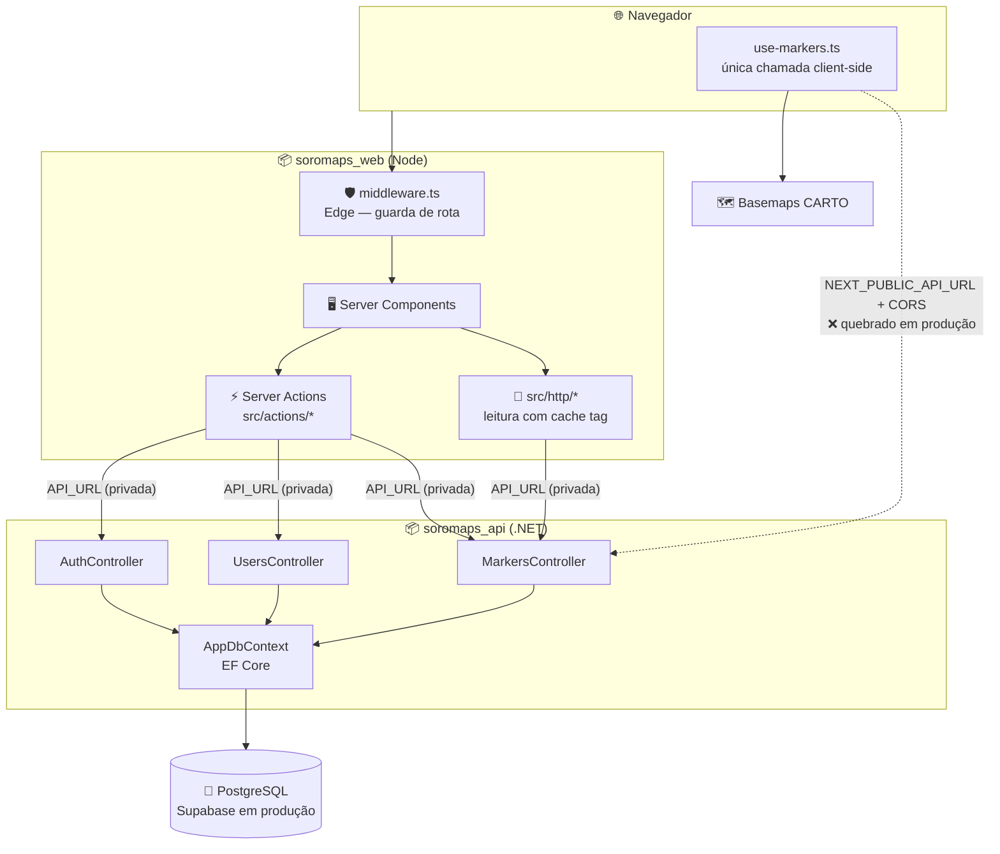

# ⚙️ 02. Arquitetura

Extraído do código dos dois repositórios.

Dois repositórios independentes, com contrato HTTP entre eles, e três provedores em produção:

| Repo | Papel | Stack | Local | Produção |
|---|---|---|---|---|
| `soromaps_web` | App web + camada de sessão | Next.js 16, React 19, TypeScript, Tailwind 4 | `:3000` | **Vercel** |
| `soromaps_api` | API REST + acesso a dados | ASP.NET Core 10 (`net10.0`), EF Core, Npgsql | `:5068` | **Azure App Service** |
| — | Persistência | PostgreSQL | instância local | **Supabase** |

Detalhe de cada ambiente, variáveis e o estado atual de produção em [08 — Deploy](./08-deploy.md).

A separação foi feita no commit inicial da API: *"transferido do projeto soromaps_web pra melhor separação de responsabilidades"*. O backend antes vivia em `src/services/Soromaps` dentro do repo web — sobraram entradas desse caminho no [`.gitignore`](../../.gitignore).

---

## 🗺️ Topologia



---

## 🔀 Os dois caminhos até a API

Essa é a característica arquitetural menos óbvia do projeto e a que mais confunde quem chega:

| Caminho | Quem usa | Variável | Exposto no browser? | Produção |
|---|---|---|---|---|
| **Server-side** | Server Actions, `src/http/*` | `API_URL` | Não | ✅ funciona |
| **Client-side** | [`src/hooks/use-markers.ts`](../../src/hooks/use-markers.ts) | `NEXT_PUBLIC_API_URL` | Sim | ❌ quebrado |

Consequências práticas:

- **Auth, CRUD de usuário e CRUD de ponto** passam pelo servidor Next.js — a URL da API fica privada e o cookie é setado no mesmo request. Funciona em produção.
- **Sobrou uma chamada no navegador:** `use-markers.ts`, que recarrega a lista de pontos quando o zoom do mapa cruza o limiar. É a última fora do padrão `src/http` + Server Action, e migrá-la depende da rota de proxy. Por causa dela `Program.cs` ainda precisa da política de CORS:

```csharp
builder.Services.AddCors(options =>
{
    options.AddPolicy(
        "AllowFrontend",
        policy => policy.WithOrigins("http://localhost:3000").AllowAnyMethod().AllowAnyHeader()
    );
});
```

> 🔴 **Isso já aconteceu.** A origem segue fixa em `http://localhost:3000`, e a API está publicada no Azure com o front na Vercel — o carregamento de marcadores está quebrado em produção. Há um segundo defeito empilhado antes desse (o `fetch` vira caminho relativo por falta de `NEXT_PUBLIC_API_URL`). Diagnóstico completo e a correção proposta em [08 — Deploy](./08-deploy.md#-estado-de-produção).

---

## 🧱 Camadas do repo web

| Camada | Pasta | Papel |
|---|---|---|
| Rotas | `src/app` | App Router: route groups `(app)`, `(auth)` e `(explorer)`, slot paralelo `@modals` |
| Leitura | `src/http` | Cliente HTTP por recurso (`users`, `markers`), envelope discriminado por `status` |
| Escrita | `src/actions` | Server Actions com Zod + `FormState` (`auth`, `users`, `markers`, `stories`) |
| Sessão | `src/lib/session.ts` | Assina e valida o JWT HS256 com Web Crypto |
| IA | `src/lib/gemini.ts` | Chamada ao Gemini para o rascunho de pauta, server-only |
| Guarda de rota | `src/middleware.ts` | Roda no Edge; redireciona por presença de sessão |
| UI | `src/components/{ui,blocks,composites,table}` | shadcn/ui + composições próprias |
| Dados fictícios | `src/mocks` | Onze arquivos — tudo que ainda não tem tabela |
| Validação | `src/validations` | Schemas Zod (`auth`, `users`, `markers`, `categories`, `achievements`, `stories`) |
| Tipos | `src/types` | Contratos de `User`, `Marker`, `Form` e `Table` |

A árvore segue o padrão Dara (Stardust) — detalhe e desvios em [06 — Frontend web](./06-frontend-web.md).

---

## 🧱 Camadas do repo API

| Camada | Pasta | Conteúdo |
|---|---|---|
| Controllers | `Controllers/` | `AuthController`, `UsersController`, `MarkersController`, `WeatherForecastController` (resto do template) |
| DTO | `DTO/` | `LoginDTO`, `UserDTO`, `MarkerDTO` |
| Models | `Models/` | `User` → `tbUsuario`, `Marker` → `markers` (mapeados por Data Annotations) |
| Dados | `Data/AppDbContext.cs` | `DbSet<User>`, `DbSet<Marker>` |

Pacotes: `Npgsql.EntityFrameworkCore.PostgreSQL`, `BCrypt.Net-Next`, `Microsoft.AspNetCore.OpenApi`.

Os controllers acessam o `AppDbContext` diretamente — não há camada de serviço nem repositório. Para o tamanho atual (2 entidades, CRUD puro) funciona; quando entrarem regras de gamificação e agregação de estatísticas, vai pedir uma camada intermediária.

---

## 🧭 Decisões deste domínio

### Repositórios separados
**Decisão:** `soromaps_web` e `soromaps_api` como repos distintos.
**Motivo:** deploy independente (host Node × host .NET) e histórico limpo por responsabilidade. Custo aceito: mudança de contrato exige PR coordenado nos dois lados.

### Controllers falando direto com o DbContext
**Decisão:** sem camada de serviço/repositório por enquanto.
**Motivo:** CRUD puro sobre duas entidades — abstração extra seria cerimônia sem ganho. Revisitar quando entrar regra de negócio de verdade (estatísticas, conquistas).

### MapLibre + CARTO em vez de Mapbox
**Decisão:** MapLibre GL renderizando estilos públicos da CARTO (`positron` claro, `dark-matter` escuro).
**Motivo:** sem token, sem conta, sem cota — e o tema do mapa acompanha o tema do app automaticamente, detectando a classe `dark` no `<html>`. Alternativa descartada: Mapbox GL, que exigiria chave em variável de ambiente e teria cota mensal.

### Fetch client-side sobrevivendo só em `use-markers.ts`
**Decisão:** o CRUD de ponto migrou para `src/http` + Server Actions em 03/08/2026; a **listagem por zoom** continua no navegador.
**Motivo:** ela reage a gesto do mapa — assina `moveend` e refaz o fetch quando o zoom cruza o limiar (`>= 14`), com `AbortController`. Não existe evento equivalente no servidor.
**Custo que se materializou:** quando a URL da API virou segredo (sem `NEXT_PUBLIC_API_URL` em produção), essa chamada parou de funcionar. A correção é a rota de proxy descrita em [08 — Deploy](./08-deploy.md#a-correção-rota-de-proxy), que mantém o carregamento por zoom intacto e ainda dispensa o CORS. O hook já carrega o `// TODO:` apontando para isso.

---

## ➡️ Próxima página

[03 — Banco](./03-banco.md)
