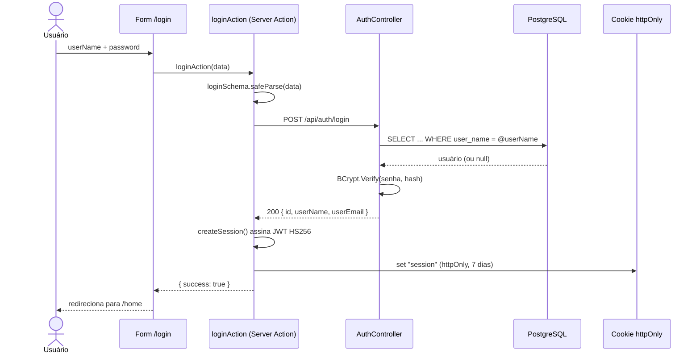

> ⚠️ Inclui uma seção de riscos conhecidos, e a API **já está publicada na internet**. Leia antes de mexer aqui.

# 🔐 05. Autenticação e sessão

O desenho é incomum e vale entender antes de mexer: **a API valida a senha, mas quem emite a sessão é o Next.js**.



---

## 🧩 As três peças

| Peça | Arquivo | Responsabilidade |
|---|---|---|
| Server Actions | [`src/actions/auth.ts`](../../src/actions/auth.ts) | `loginAction`, `registerAction`, `logoutAction` |
| Sessão | [`src/lib/session.ts`](../../src/lib/session.ts) | Assina, valida e lê o JWT |
| Guarda de rota | [`src/middleware.ts`](../../src/middleware.ts) | Redireciona conforme presença de sessão |

### Sessão

`createSession` monta um JWT HS256 **na mão**, com Web Crypto (`crypto.subtle`) — sem biblioteca de JWT:

- Header `{ alg: "HS256", typ: "JWT" }` e payload `{ id, userName, userEmail, exp }`
- Ambos em Base64 URL-safe, assinados por HMAC-SHA256 com `process.env.SESSION_SECRET`
- Validade padrão: 7 dias
- `decryptSession` verifica a assinatura e o `exp`, devolvendo `null` em qualquer falha

O motivo de não usar `jose` ou `jsonwebtoken`: `crypto.subtle` roda no runtime Edge, então o mesmo código serve ao `middleware.ts` sem polyfill nem dependência extra.

O cookie é gravado com `httpOnly: true`, `sameSite: "lax"`, `path: "/"`, `maxAge` de 7 dias e `secure` apenas em produção.

### Guarda de rota

```ts
const PROTECTED_ROUTES = [
  "/home", "/admin", "/places", "/profile", "/feed", "/discover",
  "/community", "/pautas", "/visits", "/stats", "/favorites", "/achievements",
];
const AUTH_ROUTES = ["/login", "/register"];
```

Rota protegida sem sessão → `/login`. Rota de auth com sessão → `/home`. O
`matcher` limita a execução do middleware a essas rotas.

As quatro últimas (`/visits`, `/stats`, `/favorites`, `/achievements`) só
existem como `redirect()` para as abas de `/profile` desde 19/08/2026, mas
seguem na lista: sem sessão, quem abre a URL antiga vai para o login em vez de
atravessar o redirect e cair na guarda só depois.

### Cadastro

`registerAction` chama `POST /api/users` e, se der certo, **já cria a sessão e loga o usuário** — sem etapa de confirmação de e-mail.

---

## ⚠️ Riscos conhecidos

Esta seção existe para não deixar nada implícito. Nenhum item abaixo é hipotético — todos são verificáveis no código atual.

### 1. A API não tem autenticação nenhuma

`Program.cs` chama `app.UseAuthorization()`, mas **nenhum esquema de autenticação é registrado** (não há `AddAuthentication`, nem `UseAuthentication`, nem `[Authorize]` em controller algum). Na prática, todos os endpoints de `UsersController` e `MarkersController` estão abertos: qualquer pessoa que alcance a URL da API pode listar, criar, editar e excluir usuários e marcadores, sem credencial.

O cookie de sessão do Next.js **não protege a API** — ele só protege a navegação
no front. Em produção a URL da API é tratada como segredo (não há
`NEXT_PUBLIC_API_URL` definida na Vercel), o que reduz a exposição mas não é
proteção: URL secreta não é credencial.

**Correção mínima:** a API passa a emitir o JWT (ou valida o mesmo `SESSION_SECRET` que o Next.js usa), registra `AddAuthentication().AddJwtBearer(...)`, e os controllers ganham `[Authorize]`.

### 2. Hash de senha exposto na resposta

`GET /api/users`, `GET /api/users/{id}`, `POST /api/users` e `PUT /api/users/{id}` devolvem a entidade `User` completa, incluindo `user_password` com o hash BCrypt. Combinado com o item 1, isso significa que os hashes de todos os usuários são obteníveis por uma requisição sem autenticação — material pronto para ataque offline de dicionário.

**Correção:** projetar a resposta num DTO sem o campo de senha.

### 3. Login por `userName`, cadastro por e-mail

O cadastro exige e-mail (`createUserSchema` valida `email`), mas a autenticação busca por `user_name`. Nada no banco garante que `user_name` seja único, e `FirstOrDefault` devolve silenciosamente a primeira linha que casar — com nomes duplicados, o login fica não-determinístico.

**Correção:** constraint `UNIQUE` em `user_name` (e em `user_email`), e decidir qual dos dois é o identificador oficial de login.

### 4. Enumeração de usuários

`AuthController.Login` responde `"Usuário não encontrado"` ou `"Senha incorreta"` — mensagens distintas que revelam quais contas existem. O padrão é uma resposta genérica para os dois casos.

### 5. Sem controle de papel (role)

Existe uma área `/admin` inteira — sete telas mais o CRUD de usuários — e não há
coluna de papel no banco nem verificação no middleware ou na API. **Qualquer
sessão válida acessa `/admin`** e, por consequência, exclui usuários.

O mesmo buraco aparece no lado do explorador: `/places/[id]` mostra editar e
excluir para qualquer sessão, porque `markers` não tem dono. É o gate que
destrava quando o papel existir.

### 6. `SESSION_SECRET` sem fallback é bom; sem rotação, não

`getSecretKey` lança erro explícito se `SESSION_SECRET` não existir — comportamento correto. Mas não há versionamento de chave: trocar o segredo invalida todas as sessões de uma vez. Aceitável agora; vale registrar.

---

### 7. `GEMINI_API_KEY` — o que está certo, e por quê

Vale registrar junto porque é a outra chave do projeto: ela é lida só no
servidor ([`src/lib/gemini.ts`](../../src/lib/gemini.ts)), **sem** prefixo
`NEXT_PUBLIC_`. Chave de modelo no bundle é conta de terceiro paga por quem
abrir o DevTools. Falta de chave é estado esperado (`sem-chave`), não exceção —
a tela funciona e o gerador avisa que está desligado.

---

## 🧹 Código morto relacionado

[`src/app/api/auth/login/route.ts`](../../src/app/api/auth/login/route.ts) e `src/app/api/auth/logout/route.ts` implementam o mesmo fluxo de login/logout via Route Handler. **Nenhum dos dois tem chamador** — o front usa exclusivamente as Server Actions. São de uma iteração anterior e podem ser removidos.

---

## 🧭 Decisões deste domínio

### JWT assinado no Next.js, não na API
**Decisão:** a API só valida credenciais; o token de sessão é assinado pelo servidor web.
**Motivo:** permite ao `middleware.ts` decidir acesso no Edge sem round-trip à API a cada navegação. **Custo:** a API fica sem noção de identidade — origem direta do risco nº 1.

### JWT na mão com Web Crypto
**Decisão:** implementar assinatura/verificação com `crypto.subtle` em vez de usar uma lib.
**Motivo:** compatibilidade com o runtime Edge sem dependência extra. Custo: código criptográfico próprio para manter — pequeno e revisável, mas próprio.

### Server Actions em vez de Route Handlers
**Decisão:** auth via `"use server"` chamado direto do componente.
**Motivo:** menos superfície pública (não cria endpoint acessível) e validação Zod no mesmo lugar da mutação. Os Route Handlers antigos ficaram órfãos por conta dessa migração.

---

## ➡️ Próxima página

[06 — Frontend web](./06-frontend-web.md)
