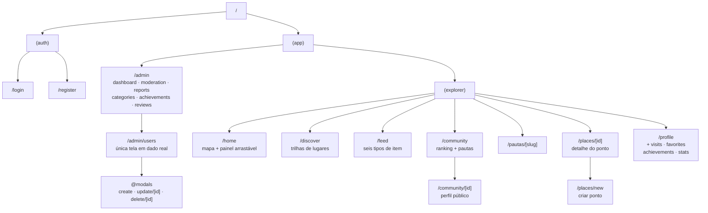
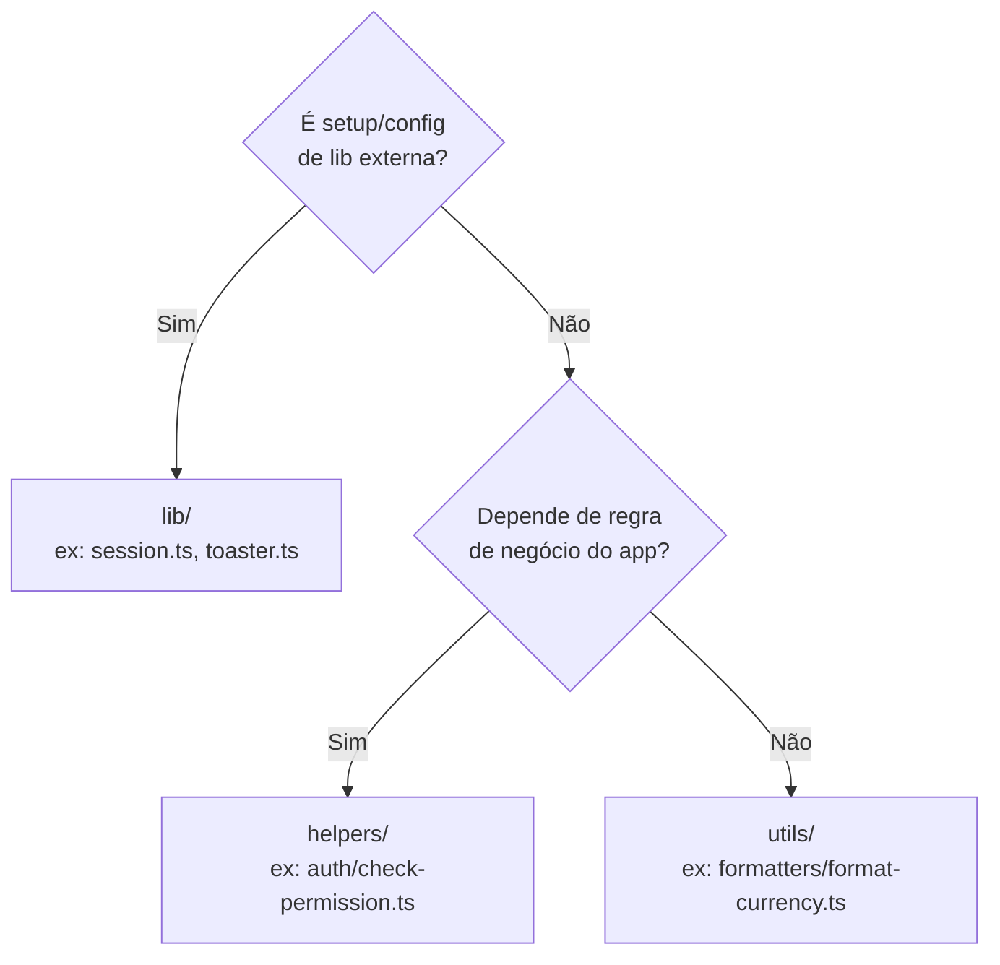
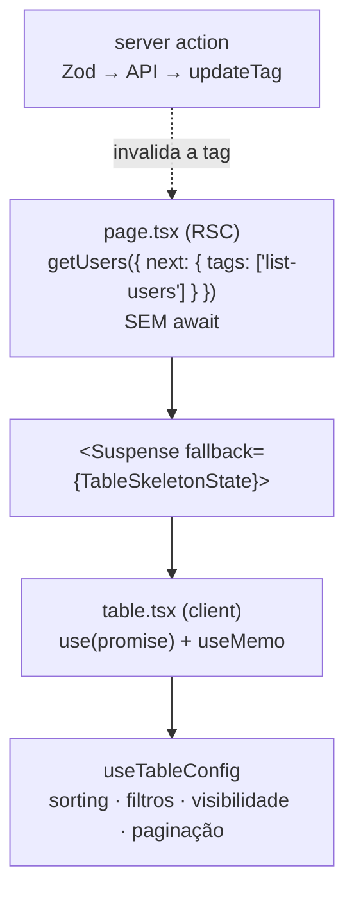

> Estrutura do repo `soromaps_web`.

# 💻 06. Frontend web

Next.js 16 com App Router, React 19, TypeScript, Tailwind CSS 4 e shadcn/ui. Lint e formatação com Biome.

```bash
npm run dev      # servidor de desenvolvimento
npm run build    # build de produção
npm run lint     # biome check
npm run format   # biome format --write
```

---

## 🗺️ Mapa de rotas



| Route group | Papel |
|---|---|
| `(auth)` | Telas públicas de login e cadastro. Sessão ativa aqui redireciona para `/home` |
| `(app)` | Área autenticada, com sidebar e `@modals` compartilhados no `layout.tsx` |
| `(explorer)` | Rotas do usuário comum — agrupadas só por não terem prefixo de URL em comum |

`admin/` não precisa de route group próprio: já é pasta real com prefixo de URL, o que a agrupa. Route group (pasta entre parênteses) nunca aparece na URL — serve para compartilhar layout, ou só organizar por pasta, sem adicionar segmento de rota.

### Rotas que só redirecionam

Cinco rotas existem apenas para URL publicada não dar 404:

| Rota | Vai para | Desde |
|---|---|---|
| `/places` | `/discover` | 17/08/2026 — a vitrine de lugares fundiu em Descobrir |
| `/visits`, `/favorites`, `/achievements`, `/stats` | aba equivalente de `/profile` | 19/08/2026 — o grupo "Eu" virou hub de cinco abas |

As abas de `/profile` são **segmento de rota**, não `useState`: conteúdo que se lê, se compartilha e ao qual se volta precisa de URL, botão voltar e F5 no lugar certo. A lista mora em `PROFILE_TABS` ([`src/constants/navigation.ts`](../../src/constants/navigation.ts)), e só a navegação é client — as cinco abas seguem Server Component.

### Rotas interceptadas em `/admin/users`

`@modals` é um **slot paralelo** que, junto com as rotas `(.)edit/[id]` e `(.)delete/[id]`, faz edição e exclusão abrirem como modal por cima da listagem quando a navegação parte de dentro do app — mas renderizarem como página inteira quando a URL é acessada diretamente ou recarregada. As rotas completas `edit/[id]` e `delete/[id]` existem exatamente para esse segundo caso, e `@modals/default.tsx` é o estado neutro do slot.

---

## 📂 Organização de pastas

O projeto adota o padrão **Dara (Stardust)**:

| Pasta | Papel | Estado |
|---|---|---|
| `src/app` | Rotas do App Router | Em uso |
| `src/actions` | Server Actions (`auth`, `users`, `markers`, `stories`) | Em uso |
| `src/http` | Clientes HTTP de leitura por recurso (`users`, `markers`) | Em uso |
| `src/components` | `ui/` (shadcn), `blocks/`, `table/` | Em uso |
| `src/constants` | Tags de cache, defaults de filtro, navegação, títulos de explorador, régua de verificação, motivos de remoção | Em uso |
| `src/hooks` | `use-mobile.ts`, `use-markers.ts`, `table/use-table-config.ts` | Em uso |
| `src/lib` | Setup de libs externas e infra (`session.ts`, `gemini.ts`, `toaster.ts`, `utils.ts`) | Em uso |
| `src/mocks` | Onze arquivos de dado fictício — tudo que ainda não tem tabela | Em uso |
| `src/helpers` | Regra de negócio própria (`achievement-criteria.ts`) | Em uso |
| `src/styles` | `globals.css` com os tokens Tailwind | Em uso |
| `src/types` | Contratos (`user`, `marker`, `form`, `table`) | Em uso |
| `src/utils` | `formatters/`, `sorts/`, `table/`, `http/` | Em uso |
| `src/validations` | Schemas Zod (`auth`, `users`, `markers`, `categories`, `achievements`, `stories`) | Em uso |
| `src/config`, `src/content`, `src/contexts`, `src/reducers`, `src/components/composites` | Criadas pelo scaffold Dara | Vazias, aguardando uso real |

### `src/mocks` — a pasta que precisa morrer

Onze arquivos, e é o maior fato do frontend hoje: **`/admin/users` é a única
tela ligada em dado real**. Feed, comunidade, pautas, perfil, descobrir e as
sete telas de admin funcionam inteiras sobre mock, esperando tabela nascer.

Duas regras que valem enquanto isso durar, e que já custaram bug:

- **Nada de `Math.random()` nem `Date.now()` em mock.** Valor aleatório ou
  relativo a "agora" renderiza diferente no servidor e no cliente e quebra a
  hidratação. Série temporal é ruído determinístico sobre data-âncora fixa.
- **Fuso fixo junto com data fixa.** Todo formatador de data em mock declara
  `timeZone: "UTC"`: dia puro (`2026-08-17`) é meia-noite UTC, e formatar no
  fuso local devolveria o dia anterior no Brasil.

Mock que **deriva** vale mais que mock que repete: `src/mocks/profile.ts`
calcula o progresso das conquistas sobre a mesma lista de visitas que
`/community` publica no ranking, então as duas telas não têm como discordar.

### Onde colocar um arquivo novo



### Desvio consciente do Dara: `_components/` colocado

O Dara diz que `app/` deve conter só rotas (`layout`, `page`, `loading`, `error`, `not-found`). Este projeto **mantém `_components/` dentro das rotas** — `home/_components/marker.tsx`, `admin/users/_components/columns.tsx` e afins.

**Motivo:** pasta com prefixo `_` é *private folder* do App Router (fica fora do roteamento por definição), e colocação é o idioma da comunidade Next.js para componente de uso exclusivo de uma rota. Empurrar tudo para `src/components/` afastaria o componente do único lugar que o usa.

**Regra prática:** usado por uma rota só → `_components/` daquela rota. Usado por duas ou mais → `src/components/`.

---

## 📋 Padrão de tela de listagem

Toda tela com tabela do sistema segue a mesma estrutura, adotada do padrão interno de telas usado pelo time. O objetivo é que criar a próxima listagem seja **preencher lacunas**, não redesenhar a arquitetura. Referência viva: `/admin/users`; `/admin/categories` é a prova de que a aposta se pagou — busca, ordenação, visibilidade de coluna, paginação e sheet de filtro vieram prontos, e o que custou foi só o domínio.

### O princípio

> **Cada arquivo responde a uma pergunta, e só a ela.**

| Arquivo | Pergunta que responde |
|---|---|
| `page.tsx` | Quais dados esta tela precisa? |
| `_components/table.tsx` | Como as peças da tabela se encaixam? |
| `_components/columns.tsx` | Como cada coluna se comporta e se apresenta? |
| `_components/toolbar.tsx` | O que o usuário pode fazer com a listagem? |
| `_components/filter-form.tsx` | Quais campos filtram, e como viram filtro de coluna? |
| `_components/row-action.tsx` / `page-action.tsx` | Para onde o usuário navega? |
| `src/validations/*` | O que é um valor válido? |
| `src/actions/*` | Como se escreve no servidor? |

Quando um desses arquivos começa a responder mais de uma pergunta, ele é quebrado.

### Anatomia

```
src/app/(app)/admin/users/
├── page.tsx                      Server Component: promises + layout
├── create/page.tsx               rota espelho — só redirect()
├── update/[id]/page.tsx          idem
├── delete/[id]/page.tsx          idem
└── _components/
    ├── table.tsx                 orquestrador (client)
    ├── columns.tsx               colunas + rótulos + visibilidade
    ├── toolbar.tsx               busca, sheet de filtro, reset, colunas
    ├── filter-form.tsx           campos do filtro (RHF)
    ├── filter-form-skeleton.tsx  fallback do Suspense do sheet
    ├── row-action.tsx            menu de ações da linha
    └── page-action.tsx           botão principal do cabeçalho

src/app/(app)/@modals/admin/(.)users/
├── _components/user-form.tsx     form compartilhado criar/editar
├── _components/user-form-modal.tsx
├── _components/delete-user-modal.tsx
├── create/page.tsx
├── update/[id]/page.tsx
└── delete/[id]/page.tsx
```

### Fluxo de dados



Três regras que amarram tudo:

1. **A promise não é aguardada no `page.tsx`.** Com `await`, o cabeçalho da página só seria enviado depois da API responder. Sem ele, o shell vai no primeiro byte e só a tabela chega por streaming. Quem desembrulha é quem precisa do valor, com `use()`.
2. **Erro de leitura é um status, não uma exceção.** A resposta de `src/http` é uma união discriminada; o consumidor faz `status === 200 ? data : []`. Não existe `try/catch` na leitura.
3. **Escrita invalida a tag que leu.** `updateTag('list-users')` na server action é o que faz a tabela recarregar sozinha quando o modal fecha — por isso **não existe `router.refresh()`** depois de salvar.

### A instância da tabela

**Nunca chame `useReactTable` dentro de `_components/`.** A instância vem de [`useTableConfig`](../../src/hooks/table/use-table-config.ts), que centraliza estado, row models e as decisões de produto (ordenação sem estado neutro, seleção múltipla). Um hook por tela faria correção de bug virar um PR por tela, e as telas divergiriam em silêncio.

Precisa de uma opção do TanStack não exposta? A assinatura estende `Partial<TableOptions>` — passe direto, sem forkar o hook.

### Contratos fáceis de quebrar

| Contrato | O que quebra se ignorado |
|---|---|
| Chaves do schema de filtro = ids das colunas | `resolveFilters` gera filtro para coluna inexistente; some sem erro |
| `id="form:submit"` no form do sheet | O botão "Aplicar filtros" para de funcionar, sem aviso |
| `data` e `columns` memoizados no orquestrador | A tabela remonta a cada render e perde ordenação, filtros e página |
| `useForm` do filtro na **toolbar**, não no form | O `filter-form` suspende; o estado do formulário seria descartado |
| Tag de `next.tags` = tag de `updateTag` | A tabela não atualiza depois de salvar |
| Coluna sem `meta.visibilityDisplayName` | Fica fora do menu "Colunas" — é assim que `actions` e `select` ficam protegidas |

### Anti-padrões

| ❌ | ✅ |
|---|---|
| `useReactTable` na tela | `useTableConfig` |
| `await` da listagem no `page.tsx` | promise crua + `use()` no client |
| `router.refresh()` após salvar | `updateTag` na action |
| `try/catch` para erro de leitura | `status === 200 ? data : []` |
| Colunas dentro de `table.tsx` | `columns.tsx` |
| Rótulo de coluna repetido | `<recurso>ColumnsNames` |
| Largura de coluna no JSX | `meta.headerClassName` / `meta.cellClassName` |
| Erro lançado da server action | retorno `FormState` + `toast` |

---

## 🪟 Modais como rota

Um modal aqui **é uma rota**, não estado local. Três peças:

1. **Slot paralelo** `src/app/(app)/@modals/`, renderizado ao lado de `children` no layout — a listagem continua montada atrás. `default.tsx` devolve `null` quando nenhum modal está ativo.
2. **Rota interceptada** `@modals/admin/(.)users/update/[id]/` — Server Component que dispara as promises, mais um wrapper client que abre o `Dialog`.
3. **Rota espelho** `admin/users/update/[id]/page.tsx` com `redirect()` — cobre acesso direto pela URL e F5, que de outro modo dariam 404.

O que isso entrega de graça: URL compartilhável, botão voltar fechando o modal, dados buscados no servidor e nenhum `useState('modalOpen')` na listagem. O custo é três arquivos por modal em vez de um.

O fechamento anima antes do `router.back()` (`MODAL_CLOSE_DELAY_MS`); sem o atraso, a rota morre no mesmo frame e o modal some sem transição.

---

## 🗺️ Componente de mapa

[`src/components/ui/map.tsx`](../../src/components/ui/map.tsx) encapsula o MapLibre GL numa API declarativa em React:

| Recurso | Como funciona |
|---|---|
| Tema | Detecta a classe `dark`/`light` no `<html>` via `MutationObserver`, com fallback em `prefers-color-scheme` |
| Basemap | Estilos públicos CARTO: `positron` (claro) e `dark-matter` (escuro) |
| Viewport | **Não-controlado.** As camadas leem a instância do MapLibre pelo contexto (`useMap()`) em vez de espelhar centro/zoom em state React |
| Marcadores e popups | Renderizados como React via `createPortal` dentro dos elementos do MapLibre |
| Controles | `MapControls` com zoom, bússola, localizar e tela cheia |

Centro inicial fixo em Sorocaba, em [`src/constants/map.ts`](../../src/constants/map.ts): `[-47.44623758514884, -23.47205863818757]`, zoom `15.5`.

**Viewport não é state React, e isso é a decisão principal do mapa.** Guardar
centro e zoom em `useState` re-renderizava painel e feed a 60fps durante o pan,
e um `useEffect` dependente de `viewport.zoom` disparava dezenas de
`GET /api/markers` por gesto de zoom — `move` dispara a cada frame.

**Carregamento de marcadores:** [`src/hooks/use-markers.ts`](../../src/hooks/use-markers.ts) assina
`moveend` (não `move`) e guarda só o booleano `zoom >= minZoom`. O fetch depende
de um booleano, não de um float: **uma requisição por cruzamento de limiar**,
com `AbortController`. Abaixo do limiar a lista é limpa, para não poluir o mapa
de longe. A filtragem continua toda client-side — a API não aceita bounding box.

### `MapDrawerLayout`

O padrão "mapa ao fundo + painel arrastável que sobe até virar a página" foi
extraído de `/home` para [`src/components/blocks/map-drawer-layout/`](../../src/components/blocks/map-drawer-layout),
com `map` como slot das camadas e `children` livre. Três armadilhas que ele
resolve, e que voltam se alguém remontar isso à mão:

| Armadilha | O que acontecia |
|---|---|
| `{!isFullyExpanded && <Map/>}` | O mapa era **desmontado** ao expandir o painel, recarregando estilo CARTO e tiles ao recolher |
| `DrawerOverlay` sempre renderizado | Deixava o mapa sob um blur permanente, num drawer `modal={false}` que nunca fecha — daí a prop `overlay` no `DrawerContent` |
| Portal para `document.body` | O `main` de `(app)/layout.tsx` tem `transform-[translateZ(0)]` e já é containing block do `fixed` do vaul — daí `noPortal` |

**Limite conhecido:** o vaul lê `document.body` durante o render, então não
sobrevive ao SSR. O layout mantém um gate `mounted`, mas renderiza no lugar um
esqueleto com a moldura do painel recolhido — a primeira pintura já tem a casca,
em vez de tela vazia.

---

## 🎨 UI

| Item | Escolha |
|---|---|
| Design system | shadcn/ui sobre Radix (`components.json` na raiz) |
| Estilo | Tailwind CSS 4 via `@tailwindcss/postcss`, tokens em `src/styles/globals.css` |
| Ícones | `lucide-react` |
| Toasts | `sonner`, com wrapper em `src/lib/toaster.ts` |
| Drawer | `vaul`, com snap points — é o painel deslizante sobre o mapa em `/home` |
| Tema | `next-themes` |

---

## 📦 Dependências

As cinco órfãs (`firebase`, `hono`, `@hono/node-server`, `leaflet`,
`react-leaflet`) foram removidas em 29/07/2026 e `shadcn` virou
`devDependency` — isso levou as vulnerabilidades de pacote de **15 para 0**.

Duas regras herdadas daquela rodada:

- **`sharp` está em `overrides` como `^0.35.3`**, fora do range que o Next
  declara (`^0.34.5`). É correção antecipada de advisory. **Reconferir a cada
  bump de versão do Next.**
- 🚫 **Nunca rodar `npm audit fix --force` neste projeto.** Antes do override,
  a "correção" que ele propunha para o `sharp` era instalar `next@14.2.35` —
  regressão de dois majors.

Dependência de UI de terceiro entra por registry e vira código nosso, não
pacote: o `AchievementBadge` veio do [Trophy UI Kit](https://ui.trophy.so) e foi
**adaptado** — o original tinha travado/desbloqueado invertidos e estava em
inglês.

---

## 🧭 Decisões deste domínio

### Server Actions como caminho padrão de mutação
**Decisão:** mutações passam por `src/actions/*` com `"use server"`, validando com Zod antes de chamar a API.
**Motivo:** validação e chamada no mesmo lugar, sem endpoint público extra, e a URL da API fica privada em `API_URL`. Exceção atual: markers, que são chamados do cliente por causa da interatividade do mapa.

### Zod como fonte dos contratos de formulário
**Decisão:** todo formulário valida contra schema em `src/validations`, com o tipo inferido por `z.infer`, e o **mesmo schema** roda no client (`zodResolver`) e dentro da server action (`safeParse`).
**Motivo:** um único lugar define regra e tipo, e a validação nunca depende só do browser — a do cliente é experiência de uso, não segurança. **Inconsistência a resolver:** `registerSchema` (com `confirmPassword`) segue sem nenhum consumidor; o cadastro usa `createUserSchema`.
**Onde o schema não serve:** conversão de `FormData` para número mora na action (`toMarkerInput`), não no schema — `z.coerce.number()` deixa o tipo de entrada `unknown` e quebra o `zodResolver` do React Hook Form.

### Leitura em `src/http`, escrita em `src/actions`
**Decisão:** separar o cliente HTTP de leitura (envelope `{ data, status, headers }`) das mutações (`"use server"` + `FormState`).
**Motivo:** são contratos diferentes. Leitura precisa ser componível e cacheável — a função recebe `RequestInit` e o chamador declara `next.tags` sem a camada HTTP saber de cache. Escrita precisa validar, invalidar tag e devolver algo que o componente saiba transformar em toast. Misturar os dois foi o que produziu o `router.refresh()` da versão anterior.

### `ui/form.tsx` escrito à mão
**Decisão:** reconstruir a API `Form`/`FormField`/`FormItem`/`FormControl`/`FormMessage` sobre o React Hook Form, em vez de instalar do registry.
**Motivo:** o style `radix-vega` do shadcn não distribui mais o `form` — foi substituído pelo `field`, que é agnóstico de biblioteca de formulário. Como o padrão de telas do time depende da API clássica, ela foi reimplementada usando `Label` e o `Slot` do Radix.

---

### Diálogo local onde o dado é mock
**Decisão:** telas sobre mock (categorias, denúncias, avaliações) usam `Dialog` com estado local em vez do slot `@modals`.
**Motivo:** rota interceptada precisa de um servidor como fonte da verdade. Com o catálogo em `useState`, a rota leria o mock original e salvaria no vazio. Migra para `@modals` junto com a API.

### Segundo consumidor promove
**Decisão:** componente nasce em `_components/` da rota; no momento em que uma segunda rota precisa dele, sobe para `src/components/blocks/`.
**Motivo:** foi assim que `StatCard`, `RemovalDialog` e `StarRating` subiram. A exceção declarada é `MapDrawerLayout`, que vive em `blocks/` com um consumidor só — foi extraído justamente para ser reusado.

---

## ➡️ Próxima página

[07 — Ambiente e setup](./07-ambiente-e-setup.md)
