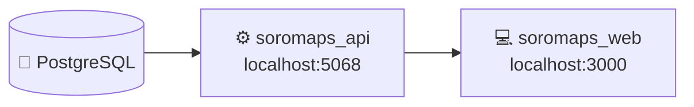

> Do zero até os dois serviços rodando **local**. Para os ambientes publicados (Vercel, Azure, Supabase), ver [08 — Deploy](./08-deploy.md).

# 🛠️ 07. Ambiente e setup local

Três peças precisam estar de pé: **PostgreSQL**, **API .NET** e **web Next.js**.



---

## 📋 Pré-requisitos

| Ferramenta | Versão |
|---|---|
| Node.js | 20+ (`@types/node` fixado em `^20`) |
| .NET SDK | 10.0 (`net10.0`) |
| PostgreSQL | qualquer versão suportada pelo Npgsql 10 |

Os dois repositórios ficam lado a lado:

```
c:\www\
├── soromaps_web\
└── soromaps_api\
```

---

## 🐘 1. Banco

Crie um banco PostgreSQL e as duas tabelas.

> ⚠️ **Não existem migrations no projeto** — não há `Migrations/` nem o pacote `Microsoft.EntityFrameworkCore.Design`. O schema precisa ser criado manualmente. O DDL abaixo reproduz exatamente o que os models mapeiam hoje:

```sql
CREATE TABLE "tbUsuario" (
    id            SERIAL PRIMARY KEY,
    user_name     VARCHAR(255) NOT NULL,
    user_email    VARCHAR(255) NOT NULL,
    user_password VARCHAR(255) NOT NULL,
    created_at    TIMESTAMP    NOT NULL,
    updated_at    TIMESTAMP    NOT NULL
);

CREATE TABLE markers (
    id   SERIAL PRIMARY KEY,
    nome VARCHAR(255) NOT NULL,
    lat  DOUBLE PRECISION NOT NULL,
    lng  DOUBLE PRECISION NOT NULL
);
```

`"tbUsuario"` precisa das aspas: PostgreSQL rebaixa identificadores não-citados para minúsculo, e o mapeamento em `Models/User.cs` usa maiúscula no meio do nome.

Adotar Migrations é item de fundação no [backlog](./09-backlog.md).

---

## ⚙️ 2. API

```bash
cd ../soromaps_api
dotnet restore
dotnet run
```

Sobe em `http://localhost:5068` (e `https://localhost:7240` no perfil `https`), conforme `Properties/launchSettings.json`. Em `Development`, o documento OpenAPI fica em `/openapi/v1.json`.

### Configuração

A connection string vem de `ConnectionStrings:DefaultConnection`. O `appsettings.json` versionado tem o valor **vazio de propósito** — preencha por `appsettings.Development.json` (ignorado pelo git) ou por variável de ambiente:

```jsonc
// appsettings.Development.json
{
  "ConnectionStrings": {
    "DefaultConnection": "Host=localhost;Port=5432;Database=soromaps;Username=postgres;Password=SUA_SENHA"
  }
}
```

Equivalente por variável de ambiente:

```powershell
$env:ConnectionStrings__DefaultConnection = "Host=localhost;Database=soromaps;Username=postgres;Password=SUA_SENHA"
```

### CORS

`Program.cs` libera apenas `http://localhost:3000`. Rodar o front em outra porta quebra o carregamento de marcadores por zoom (a única chamada client-side que sobrou) — ajuste a origem no `Program.cs`, ou torne-a configurável, item de fundação no [backlog](./09-backlog.md).

---

## 💻 3. Web

```bash
cd soromaps_web
npm install
npm run dev
```

Sobe em `http://localhost:3000`.

### Variáveis de ambiente

Crie um `.env.local` na raiz do repo web:

```bash
# URL da API usada pelo servidor Next.js (Server Actions, route handlers).
# Privada — nunca chega ao browser.
API_URL=http://localhost:5068

# URL da API usada por use-markers.ts, no navegador.
# Vai para o bundle — é pública por natureza.
NEXT_PUBLIC_API_URL=http://localhost:5068

# Segredo do HMAC que assina o cookie de sessão.
# Sem ele, qualquer rota que toque sessão lança erro na hora.
SESSION_SECRET=troque-por-uma-string-longa-e-aleatoria

# Chave do Gemini, usada só no servidor pelo gerador de rascunho de pauta.
# Opcional: sem ela a tela funciona e o gerador avisa que está desligado.
GEMINI_API_KEY=
```

| Variável | Onde é lida | Se faltar |
|---|---|---|
| `API_URL` | `src/http/*`, `src/actions/*` | `fetch` monta `undefined/api/...` e falha |
| `NEXT_PUBLIC_API_URL` | [`src/hooks/use-markers.ts`](../../src/hooks/use-markers.ts) | Cai no fallback `""` — a chamada vira caminho relativo, bate no próprio Next.js e retorna 404 |
| `SESSION_SECRET` | `src/lib/session.ts` | Erro explícito: `SESSION_SECRET must be defined in your environment variables` |
| `GEMINI_API_KEY` | `src/lib/gemini.ts` | Estado esperado, não erro: o gerador de pauta devolve `sem-chave` e a tela avisa |
| `GEMINI_MODEL` | `src/lib/gemini.ts` | Usa o padrão `gemini-2.5-flash` |

As duas primeiras apontam para o mesmo lugar em desenvolvimento.

> 🔴 **Em produção a segunda não existe.** `NEXT_PUBLIC_API_URL` foi deliberadamente deixada de fora da Vercel, porque tudo com esse prefixo é gravado em texto puro no bundle e a URL da API é tratada como segredo. É por isso que o mapa não carrega marcadores em produção hoje. Ver [08 — Deploy](./08-deploy.md#-estado-de-produção).

> 🔑 **`GEMINI_API_KEY` nunca leva `NEXT_PUBLIC_`.** Chave de modelo no bundle é conta de terceiro paga por quem abrir o DevTools.

> 📄 Existe um `.env.example` na raiz do repo web, mas ele **não é versionado**: a regra `.env*` do `.gitignore` também o captura. Quem clona o repositório não o recebe — corrigir exige uma exceção `!.env.example`.

---

## ✅ Verificação rápida

```bash
# 1. API respondendo
curl http://localhost:5068/api/markers

# 2. Criar um marcador
curl -X POST http://localhost:5068/api/markers \
  -H "Content-Type: application/json" \
  -d '{"nome":"Teste","lat":-23.472,"lng":-47.446}'

# 3. Criar um usuário
curl -X POST http://localhost:5068/api/users \
  -H "Content-Type: application/json" \
  -d '{"userName":"teste","email":"teste@exemplo.com","password":"Senha123"}'
```

Depois: abrir `http://localhost:3000/login`, entrar com `teste` / `Senha123` e conferir se `/home` mostra o marcador criado. Zoom abaixo de 14 esconde os marcadores — é comportamento esperado.

---

## 🧯 Problemas comuns

| Sintoma | Causa provável |
|---|---|
| Mapa carrega, marcadores não aparecem | `NEXT_PUBLIC_API_URL` ausente, ou zoom abaixo de 14 |
| Erro de CORS no console | Front fora de `http://localhost:3000` — origem fixa em `Program.cs` |
| `SESSION_SECRET must be defined` | Falta a variável no `.env.local` |
| Login sempre "Usuário não encontrado" | Usuário criado direto no banco com senha em texto puro — o hash precisa vir do `POST /api/users` |
| `relation "tbUsuario" does not exist` | Tabela criada sem aspas e rebaixada para minúsculo |
| Funciona local mas não em produção | Quase sempre variável de ambiente ausente na Vercel, ou o defeito conhecido do mapa — ver [08](./08-deploy.md#-estado-de-produção) |
| Conexão ao Supabase pendura até o timeout, sem erro | Connection string usando o host direto `db.<ref>.supabase.co`, que é **IPv6-only**. Usar o **session pooler** (porta 5432) — ver [08](./08-deploy.md#use-o-pooler-nunca-a-conexão-direta) |
| `XX000: (ENOTFOUND) tenant/user ... not found` | `Username` do pooler sem o sufixo (`postgres.<project-ref>`, não `postgres`), ou prefixo `aws-0-`/`aws-1-` errado. Copiar do painel em **Connect → Session pooler** |
| Erro de *prepared statement* ao apontar para o Supabase | Connection string na porta **6543** (transaction mode), que descarta estado de sessão. Usar a 5432 |
| Tela mostra dado que não existe no banco | Esperado: só `/admin/users` lê dado real. O resto vem de `src/mocks/*` |

---

## ➡️ Próxima página

[08 — Deploy e infraestrutura](./08-deploy.md) — os ambientes publicados.
