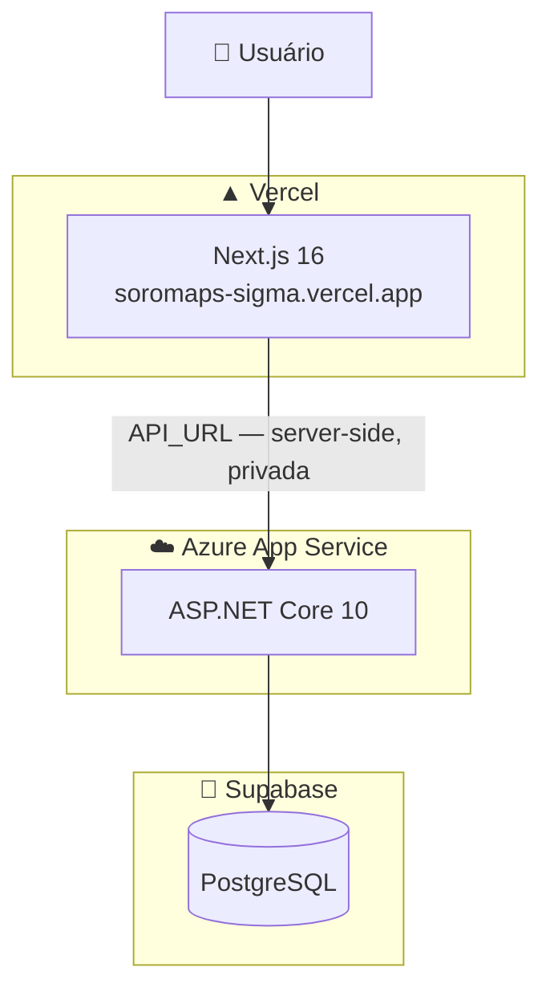
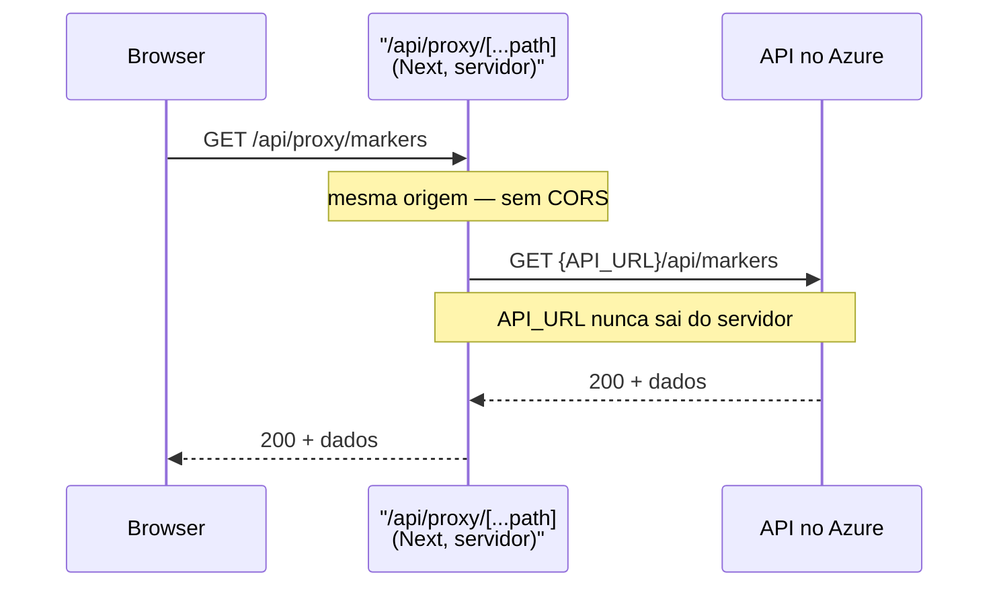

> Estado real dos ambientes, com a conexão de banco revista em 16/08/2026. Inclui um defeito conhecido em produção — ver [Estado de produção](#-estado-de-produção).

# 🚀 08. Deploy e infraestrutura

Três serviços, três provedores:

| Camada | Provedor | O que roda |
|---|---|---|
| Front-end | **Vercel** | Next.js 16 — [soromaps-sigma.vercel.app](https://soromaps-sigma.vercel.app) |
| API | **Azure App Service** | ASP.NET Core 10. URL tratada como segredo |
| Banco | **Supabase** | PostgreSQL gerenciado |



---

## ▲ Front-end — Vercel

**Deploy:** automático a cada push na branch principal, pela integração do GitHub com a Vercel. Não há workflow no repositório — a Vercel dispara o build sozinha.

**Variáveis de ambiente** (painel da Vercel, não versionadas):

| Variável | Papel | Exposta ao browser? |
|---|---|---|
| `API_URL` | URL da API no Azure, usada por Server Actions e pela camada `src/http` | **Não** |
| `SESSION_SECRET` | Segredo HMAC que assina o cookie de sessão | **Não** |
| `GEMINI_API_KEY` | Chave do Gemini, usada pelo gerador de rascunho de pauta | **Não** |

> `NEXT_PUBLIC_API_URL` **não é definida em produção**, por decisão: a URL da API é tratada como segredo, e qualquer variável com esse prefixo é gravada em texto puro no JavaScript que o visitante baixa. A consequência disso está em [Estado de produção](#-estado-de-produção).

---

## ☁️ API — Azure App Service

**Deploy:** manual ("na unha") — publish pelo Visual Studio / Azure CLI. Não existe `.github/workflows` no repositório da API.

**Configuração** (Application Settings do App Service, não versionadas):

| Chave | Valor |
|---|---|
| `ConnectionStrings__DefaultConnection` | String de conexão do Supabase |

O `appsettings.json` versionado mantém `DefaultConnection` **vazia** de propósito — o valor real nunca entra no repositório. O `__` (duplo underscore) é a convenção do .NET para representar aninhamento de configuração em variável de ambiente.

---

## 🐘 Banco — Supabase

PostgreSQL gerenciado, acessado pela API via `Npgsql`.

O schema foi criado **manualmente no SQL Editor** do painel. O projeto continua sem EF Core Migrations, então:

- não há forma reproduzível de recriar o banco do zero;
- mudança de model não gera diff versionado;
- **há dois schemas mantidos à mão** — local e Supabase — sem nada que os compare.

Detalhe das tabelas em [03 — Banco](./03-banco.md).

### Use o pooler, nunca a conexão direta

O Supabase oferece dois caminhos de conexão, e **um deles não é alcançável da maioria das redes**:

| Caminho | Host | IP |
|---|---|---|
| Conexão direta | `db.<ref>.supabase.co` | **só IPv6** — nenhum registro A |
| Pooler (Supavisor) | `aws-<n>-<region>.pooler.supabase.com` | IPv4 e IPv6 |

Desde janeiro de 2024 o host direto responde apenas por IPv6. Rede que não roteia IPv6 — a maioria dos roteadores residenciais brasileiros, e a saída do Azure App Service, que é IPv4-only — simplesmente não chega lá: a conexão pendura até estourar o timeout, sem mensagem que aponte a causa.

O sintoma que revelou isso: a API conectava em rede móvel e **nunca** em Wi-Fi,
em qualquer Wi-Fi. Carrier brasileiro entrega IPv6 de verdade; roteador
residencial costuma anunciar prefixo sem rotear nada pra fora. Confirmado
medindo que nem `ipv6.google.com:443` respondia na mesma rede, enquanto o
pooler conectava por IPv4 em 1,5s.

⚠️ **Vale para produção também:** a mesma string precisa estar nas Application
Settings do App Service, não só na máquina local.

A string em uso é a do **session pooler**:

```
Host=aws-1-sa-east-1.pooler.supabase.com;Port=5432;Database=postgres;Username=postgres.<ref>;Password=<senha>;SSL Mode=Require;Trust Server Certificate=true
```

Dois detalhes que derrubam a autenticação se passarem batido:

- o `Username` **não** é `postgres`, e sim `postgres.<project-ref>` — o pooler usa o sufixo para saber qual projeto atender. Errar isso devolve `XX000: (ENOTFOUND) tenant/user ... not found`
- o prefixo `aws-0-` / `aws-1-` varia por projeto. O mesmo erro `tenant/user not found` aparece quando a região está certa mas o prefixo não — sempre copie do painel: **Connect → Session pooler**

Sobre o modo: usamos **session (5432)**, que é proxy transparente e suporta o protocolo Postgres inteiro. O **transaction (6543)** escala melhor, mas descarta estado de sessão entre comandos — prepared statement, `SET`, tabela temporária e `LISTEN/NOTIFY` param de funcionar, e exigiria `Max Auto Prepare=0` e `No Reset On Close=true` no Npgsql. Como o Npgsql já mantém pool próprio no cliente e a API roda numa instância só, o transaction mode não compra nada aqui.

---

## 🔴 Estado de produção

**As funcionalidades de mapa estão quebradas em produção.** São dois defeitos empilhados no mesmo caminho, e vale entender a ordem porque o primeiro acontece antes do segundo:

### 1. O `fetch` vira caminho relativo

[`src/hooks/use-markers.ts`](../../src/hooks/use-markers.ts) roda no navegador e lê a URL assim:

```ts
// TODO: trocar por /api/proxy — NEXT_PUBLIC_API_URL não é definida em produção
const API_URL = process.env.NEXT_PUBLIC_API_URL || "";
fetch(`${API_URL}/api/markers`, { signal: controller.signal });
```

Sem `NEXT_PUBLIC_API_URL` definida, `API_URL` vira `""` e a chamada final é `fetch("/api/markers")` — um caminho **relativo**, que bate em `soromaps-sigma.vercel.app/api/markers`. Essa rota não existe no Next: **404**.

### 2. O CORS não conhece a Vercel

Mesmo que a variável fosse definida, `Program.cs` libera uma única origem:

```csharp
policy.WithOrigins("http://localhost:3000")
```

O navegador bloquearia a chamada vinda de `soromaps-sigma.vercel.app`.

### O que continua funcionando

Login, cadastro, o CRUD de usuários e o CRUD de pontos (`/places/[id]`,
`/places/new`) — todos passam por Server Actions e pela camada `src/http`, que
rodam **no servidor** com `API_URL` e nunca dependem de CORS. O que quebrou foi
só a **listagem por zoom** no mapa, que é o único fetch que sobrou no navegador.

As telas sobre mock (`/feed`, `/community`, `/discover`, `/profile`, `/admin/*`
menos usuários) funcionam em produção porque não chamam a API — o que elas
mostram é fictício nos dois ambientes.

### A correção: rota de proxy

Em vez de reexpor a URL da API com `NEXT_PUBLIC_API_URL` (o que anularia a decisão de tratá-la como segredo), o caminho é um **proxy no próprio Next**:



Resolve os dois defeitos de uma vez:

| Problema | Como o proxy resolve |
|---|---|
| 404 por caminho relativo | O caminho relativo passa a existir de verdade |
| CORS bloqueando | Mesma origem — CORS deixa de se aplicar |
| URL da API no bundle | Nunca chega ao browser; só o servidor Next a conhece |

É o padrão `proxy-e-segredos` usado pelo time. Enquanto ele não existe, a alternativa mínima é definir `NEXT_PUBLIC_API_URL` na Vercel **e** liberar a origem no CORS — o que funciona, mas publica a URL da API no bundle.

---

## 🧭 Decisões deste domínio

### URL da API como segredo
**Decisão:** não definir `NEXT_PUBLIC_API_URL` em produção.
**Motivo:** `NEXT_PUBLIC_` significa **público** — o valor é substituído em texto puro num `.js` que qualquer visitante baixa. Como a API não tem autenticação ([ver riscos](./05-autenticacao-e-sessao.md)), publicar a URL entregaria um endpoint aberto de CRUD de usuários a quem abrisse o DevTools. **Custo assumido:** a listagem de marcadores por zoom parou, até a rota de proxy existir.

### Três provedores em vez de um só
**Decisão:** Vercel (front), Azure (API) e Supabase (banco).
**Motivo:** cada camada foi para onde tem melhor tier gratuito e menos configuração — Next.js na Vercel é deploy sem configuração alguma; ASP.NET Core no Azure é o caminho de menor atrito; Postgres gerenciado no Supabase evita administrar servidor de banco. **Custo:** três painéis para configurar, três lugares onde uma variável de ambiente pode faltar.

### Banco pelo pooler, em session mode
**Decisão:** conectar em `aws-1-sa-east-1.pooler.supabase.com:5432` em vez do host direto `db.<ref>.supabase.co`.
**Motivo:** o host direto é **IPv6-only**, e nem toda rede roteia IPv6 — o sintoma que revelou isso foi a API conectar em rede móvel e nunca em Wi-Fi, em qualquer Wi-Fi. O pooler tem IPv4. Session mode em vez de transaction porque é drop-in: o EF Core não precisa de ajuste nenhum, e o ganho de escala do transaction não se aplica a uma instância única cujo Npgsql já poola no cliente.

### Deploy manual da API
**Decisão:** publish pelo Visual Studio, sem pipeline.
**Motivo:** escopo de TCC e frequência baixa de alteração no backend. Vale montar um workflow de GitHub Actions quando o backend passar a mudar com regularidade — hoje o risco é publicar de uma máquina com estado local diferente do repositório.

---

## ➡️ Próxima página

[09 — Backlog e dívida](./09-backlog.md)
