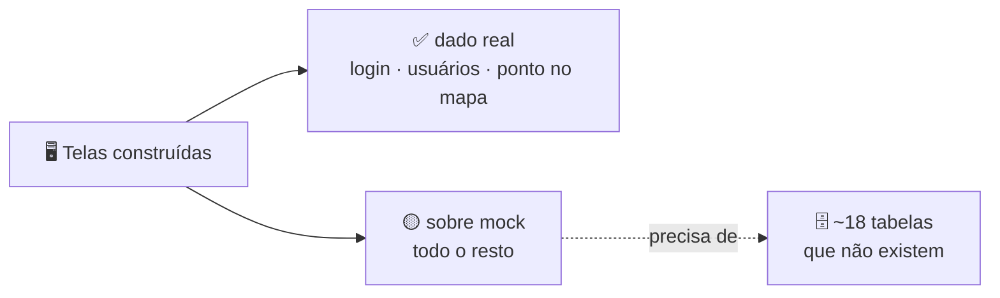

> 🚦 **A página que envelhece mais rápido.** É a que se consulta antes de
> estimar qualquer tarefa: reúne tudo que se sabe que está errado ou faltando,
> priorizado. Item concluído sai daqui e do [`/CLAUDE.md`](../../CLAUDE.md) na
> mesma entrega — não no fim da sprint.

# 🚦 09. Backlog e dívida

O front correu muito à frente do banco. É deliberado — ver a decisão de
09/08/2026 no `/CLAUDE.md`: construir a tela inteira sobre mock antes de mexer
no schema, para ver o fluxo funcionando antes de pagar migração. O custo é este
documento.

---

## 📊 Onde o dado é real

| Camada | Real | Fictício |
|---|---|---|
| Sessão e identidade | Login, cadastro, cookie HS256, guarda de rota | — |
| Usuários | CRUD completo em `/admin/users` | — |
| Pontos no mapa | Criar, editar, excluir, listar (`nome`, `lat`, `lng`) | Foto, descrição, categoria, tags, nota, wifi, petfriendly, melhor horário, segredo local |
| IA | Chamada ao Gemini em `src/lib/gemini.ts` | O restante da pauta (persistência, fila de revisão) |
| Todo o resto | — | Feed, comunidade, pautas, perfil, descobrir e as seis telas de admin fora de usuários |

Estado módulo a módulo em [`docs/todo/README.md`](../todo/README.md).

---

## 🧹 Dívida conhecida no código

| Item | Onde | Detalhe |
|---|---|---|
| Route Handlers órfãos | `src/app/api/auth/{login,logout}/route.ts` | Sem nenhum chamador; o front usa Server Actions |
| `registerSchema` sem uso | [`src/validations/auth.ts`](../../src/validations/auth.ts) | Nenhum import; o cadastro usa `createUserSchema` |
| `WeatherForecastController` | `soromaps_api/Controllers` | Resto do template `dotnet new webapi` |
| Caminho antigo do backend | [`.gitignore`](../../.gitignore) | Regras para `/src/services/Soromaps`, que não existe mais |
| `.env.example` ignorado pelo git | [`.gitignore`](../../.gitignore) | O arquivo existe na raiz, mas a regra `.env*` também o captura. Falta a exceção `!.env.example` |
| Sem atualização parcial de usuário | `soromaps_api/Controllers/UsersController.cs` | `PUT` re-hasheia a senha em toda chamada — por isso o formulário de edição **exige** a senha. Correção: `Password` opcional no `UserDTO` + re-hash condicional, ou um `PATCH` |
| Última chamada de API no cliente | [`src/hooks/use-markers.ts`](../../src/hooks/use-markers.ts) | Fora do padrão `src/http` + Server Action, e **quebrada em produção**. Depende do `/api/proxy` |
| `bin/` e `obj/` versionados | `soromaps_api` | O repositório da API não tem `.gitignore` |
| Nomenclatura de tabela | `tbUsuario` × `markers` | Três convenções em duas tabelas — vale padronizar antes de criar as próximas |
| Cinco lugares mostram "Nível N" | `blocks/{place-leaderboard,verified-comment-card}.tsx`, `admin/moderation/_components/author-card.tsx`, stub de `/admin/achievements` | Sobra da gamificação com XP, cancelada em 12/08/2026. Devem migrar para `explorerTitle`/`explorerCredential` |

---

## 🔴 Gap entre local e produção

O projeto está publicado (Vercel + Azure + Supabase), e um ponto do código não
acompanhou: o carregamento de marcadores por zoom.

| Funcionalidade | Local | Produção |
|---|---|---|
| Login, cadastro, sessão | ✅ | ✅ |
| CRUD de usuários (`/admin/users`) | ✅ | ✅ |
| Criar / editar / excluir ponto | ✅ | ✅ |
| **Listar marcadores no mapa** | ✅ | ❌ |
| Telas sobre mock | ✅ | ✅ (fictícias nos dois) |

Dois defeitos empilhados: sem `NEXT_PUBLIC_API_URL` na Vercel (decisão
deliberada — a URL da API é segredo), o `fetch` cai no fallback `""` e vira
caminho relativo, dando 404; e mesmo que não desse, o CORS do `Program.cs` só
conhece `http://localhost:3000`.

O que separa as linhas: tudo que funciona passa pelo **servidor**; o que quebrou
passa pelo **navegador**. Diagnóstico e correção em
[08 — Deploy](./08-deploy.md#-estado-de-produção).

---

## 🚦 Prioridades

### 🔥 P0 — quebrado em produção

1. **Criar a rota `/api/proxy/[...path]`** e migrar `use-markers.ts` para ela — devolve o mapa ao ar, dispensa o CORS e mantém a URL da API fora do bundle. Ver [08 — Deploy](./08-deploy.md#a-correção-rota-de-proxy)

> Enquanto o proxy não existe, o paliativo é definir `NEXT_PUBLIC_API_URL` na Vercel **e** liberar a origem no CORS. Funciona, mas publica a URL da API no bundle — e, como a API não tem autenticação, entrega um CRUD de usuários aberto a quem abrir o DevTools. **Não faça isso sem antes resolver o item 2.**

### 🔴 P1 — segurança (a API já está publicada na internet)

2. Registrar autenticação na API (`AddAuthentication` + `[Authorize]` nos controllers) — hoje **todo endpoint é público**
3. Parar de devolver `user_password` nas respostas de `/api/users` (DTO de saída)
4. Constraint `UNIQUE` em `user_name` e `user_email`
5. Resposta genérica de erro no login (fim da enumeração de usuários)
6. Papel/role de administrador, checado no middleware **e** na API — destrava também o gate de `/places/[id]`, que hoje mostra editar/excluir para qualquer sessão

Contexto completo em [05 — Autenticação e sessão](./05-autenticacao-e-sessao.md).

### 🟠 P2 — fundação

7. EF Core Migrations — o schema hoje é mantido à mão em **dois** lugares (local e Supabase), sem nada que os compare
8. FK ligando `markers` ao usuário criador
9. Padronizar nomenclatura de tabelas e colunas
10. Origem de CORS configurável (hoje `http://localhost:3000` fixo em `Program.cs`)
11. Versionar o `.env.example` (hoje capturado pela regra `.env*`) e criar um no repo da API
12. `.gitignore` no repo da API, tirando `bin/`/`obj/` do controle de versão
13. Atualização parcial de usuário na API (senha opcional no `PUT`, ou um `PATCH`)
14. `src/lib/fetcher.ts` + env validado com `server-only`
15. Pipeline de deploy da API (hoje é publish manual pelo Visual Studio)

### 🟡 P3 — produto

Cada item aqui **tira uma tela pronta do mock**. A ordem sugerida está em
[`docs/todo/README.md`](../todo/README.md).

| # | O que | Destrava |
|---|---|---|
| 16 | Expansão do modelo de Ponto ([proposta](../propostas/2026-08-03-expansao-modelo-ponto.md)) | `/discover`, `/places/[id]`, os 8 campos que o formulário coleta e descarta |
| 17 | `Categoria` | `/admin/categories`, filtro por categoria, motivo `categoria` do feed |
| 18 | `Analise` | `/admin/reviews`, avaliação na página do ponto, contadores do selo |
| 19 | `Comentario` | Conversa em torno da avaliação |
| 20 | `Visita` | Aba `/profile/visits`, motivo `perto`, régua do selo, cobertura da cidade |
| 21 | `Favorita` | "Acompanhar lugar", motivo `salvo`, aba `/profile/favorites` |
| 22 | `Conquista` + `GanhaConquista` | Galeria de `/profile/achievements`, título de explorador, `/admin/achievements` |
| 23 | Coluna `status` em ponto + tabela de decisão | Fila de `/admin/moderation` |
| 24 | `Denuncia` + `Feedback` | `/admin/reports` |
| 25 | Persistir a pauta (`slug`, `status`, `origem`, corpo) + fila de revisão | `/pautas/[slug]` deixa de depender de cópia à mão do rascunho do Gemini |
| 26 | Upload de fotos | Foto de ponto e de avaliação |
| 27 | `GET /api/admin/stats` | `/admin/dashboard` sem N chamadas de lista só para contar |
| 28 | Selo de verificado como coluna derivada | Hoje `isVerifiedExplorer` roda sobre contadores fictícios |
| 29 | Paginação e filtro por bounding box em `/api/markers` | Mapa com volume real; o hook de tabela já suporta paginação server-side |
| 30 | App mobile Expo | — |

### 🟢 P4 — limpeza

31. Apagar os Route Handlers órfãos e o `WeatherForecastController`
32. Limpar as regras obsoletas do `.gitignore` (`/src/services/Soromaps`)
33. Remover `registerSchema` de `src/validations/auth.ts` ou passar a usá-lo
34. Migrar os cinco lugares com "Nível N" para `explorerTitle`/`explorerCredential`
35. Reconferir o override de `sharp` a cada bump do Next (ver abaixo)

---

## 🔓 Vulnerabilidades de pacote — de 15 para 0

Resolvido em 29/07/2026. Registrado porque duas regras sobreviveram ao ajuste.

| Origem | Ação | Resultado |
|---|---|---|
| `firebase`, `hono`, `@hono/node-server`, `leaflet`, `react-leaflet` | removidas (nenhum import em `src/`) | −9, incluindo a única `critical` (`websocket-driver`) |
| `next` 16.2.6 → **16.2.12** | atualização de patch | −1 `high` — era **bypass de middleware/proxy no App Router**, e o `middleware.ts` é a guarda de rota do projeto |
| `postcss` | `overrides` apertado para `^8.5.25` | −1 `high` |
| `sharp` | `overrides` para `^0.35.3` | −2 (mesmo advisory, contado pelo pacote e pelo Next que depende dele) |

O Next 16.2.12 ainda declara `sharp: ^0.34.5` — a 0.35 só vira dependência oficial a partir da canary `16.3.0`. O override força a versão corrigida antes disso chegar à stable; validado com `npm run build`.

> ⚠️ **Reconferir a cada bump do Next.** Por não ser a versão que o Next testou oficialmente, se uma stable futura declarar `sharp: ^0.36` ou remover compatibilidade com a 0.35, o override pode precisar de ajuste.

> 🚫 **Nunca rodar `npm audit fix --force` neste projeto.** Antes deste ajuste, a "correção" que ele propunha para o `sharp` era instalar `next@14.2.35` — regressão de dois majors.

---

## ⬅️ Voltar

[00 — Home](./00-home.md)
